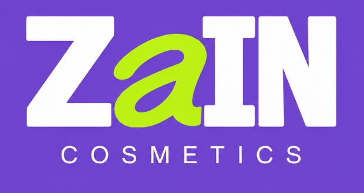

# ZAIN COSMETICS ? ?????? ????? ???????

??? ???????? ????? ???? ???????? ??????? ?????? ????? ??????. ????? ??? ????? **???? ????? ?? ??????? ?? ????? ?????? ??????**. ??????? ??????? ???????? ?? ???????? ?? ????? ????????? ??? ????? ?????? ?????.

## ????? ???????

- ?????? ???????: https://mhmdqabl615-del.github.io/zain-cosmetics-store/
- ???? ???????: https://mhmdqabl615-del.github.io/zain-cosmetics-store/admin.html
- ????? ????? Supabase: [SETUP-OWNER.md](SETUP-OWNER.md)

## ????? ??????

- `index.html`, `styles.css`, `script.js`: ????? ?????? ??????? ???? ???????? ?????? ?????? ?? Supabase.
- `storefront-catalog.js`, `product.html`, `product-details.js`, `cart-storage.js`, `supabase-config.js`: ????? ???????? ??????? ??????? ??? ???????? ?????? ??????? ?????.
- `admin.html`, `admin.css`, `admin.js`: ???? ?????? ?????? ???????? ???????? ???????? ???????? ?????? ?????? ???????? ???? ??????.
- `supabase/setup.sql`: ????? ?????? ??????? Row Level Security (RLS) ???????? ???? ??????. ??????? ?????? ????? ?????? ?????? ??? ????? ????? ????? ????????.
- `.github/workflows/deploy-pages.yml`: ??? GitHub Pages ???????? ??? ??????? ??? ????? `main`.
- `SETUP-OWNER.md`: ??????? ????? Supabase ?????? ????? ???????? ??????.

## ??????? ?????? ???????

- ??? ????? ????? ???? ??? ????? ?? ??? **?????** ?? ???? ????? ???????. ????? ????? ??????? ???????? ?? ???????? ??????? ????? ?????? ??????.
- ????? `supabase-config.js` ??? URL ??????? ?????? Supabase **Publishable** ????? ???. ??????? ????? ???? ????????? ?? ????? ?????? ???? ????? ???????? ?????? ??? ?????? RLS.
- ?? ??? ????? `service_role` ?? ??????? ????? ?? ?????? ?? GitHub ?? ??? ?????.
- ?????? ?????? ????? ???????? ?????? ???. ????? ???????? ???????? ?????? ??? ??????. ??????? ?????? ??????? ?? ???? ????? ??? ?????????.

## ??????? ????? ?????? ?????

### `.github/workflows/deploy-pages.yml`

```yaml
name: Deploy cosmetics store

on:
  push:
    branches: ["main"]
  workflow_dispatch:

permissions:
  contents: read
  pages: write
  id-token: write

concurrency:
  group: pages
  cancel-in-progress: true

jobs:
  deploy:
    environment:
      name: github-pages
      url: ${{ steps.deployment.outputs.page_url }}
    runs-on: ubuntu-latest
    steps:
      - uses: actions/checkout@v4
      - uses: actions/configure-pages@v5
        with:
          enablement: true
      - uses: actions/upload-pages-artifact@v3
        with:
          path: .
      - id: deployment
        uses: actions/deploy-pages@v4
```

### `admin.css`

```css
:root {
  color-scheme: light;
  --purple: #6f45cf;
  --lime: #b5e526;
  --forest: #526b1d;
  --paper: #fbf8f4;
  --ink: #302b28;
  --muted: #817771;
  --border: #e9e2dc;
  --panel: #fffefd;
  --sans: "DM Sans", Arial, sans-serif;
  --serif: "Playfair Display", Georgia, serif;
}

* { box-sizing: border-box; }
[hidden] { display: none !important; }
body { margin: 0; background: #f7f5f3; color: var(--ink); font-family: var(--sans); font-size: 13px; -webkit-font-smoothing: antialiased; }
button, input, textarea { font: inherit; }
button, a, input[type="checkbox"], input[type="color"] { -webkit-tap-highlight-color: transparent; }
a { color: var(--forest); }
.admin-main { max-width: 1440px; min-height: 100vh; margin: 0 auto; padding: 34px; }
.connection-card, .login-card { width: min(520px, 100%); margin: clamp(20px, 8vh, 80px) auto; padding: 38px; border: 1px solid var(--border); background: var(--panel); box-shadow: 0 16px 50px #302b280c; }
.login-card { width: min(450px, 100%); }
.admin-logo { display: block; width: 148px; height: 78px; margin-bottom: 29px; overflow: hidden; background: var(--purple); }
.admin-logo img { width: 100%; height: 100%; object-fit: contain; }
.eyebrow { margin: 0 0 11px; color: #96675c; font-size: 10px; font-weight: 700; letter-spacing: .12em; }
h1, h2, p { margin-top: 0; }
h1, h2 { margin-bottom: 0; }
.connection-card h1, .login-card h1 { font-family: var(--serif); font-size: 37px; font-weight: 400; letter-spacing: -.04em; }
.connection-description, .login-description { margin: 12px 0 20px; color: var(--muted); font-size: 12px; line-height: 1.9; }
.setup-steps { margin: 0 0 22px; padding-right: 20px; color: #5f5751; font-size: 11px; line-height: 1.95; }
.setup-steps li { margin: 0 0 7px; padding-right: 4px; }
.setup-steps a { color: var(--forest); text-underline-offset: 3px; }
.setup-steps code { direction: ltr; display: inline-block; color: #715e51; font-family: Consolas, monospace; font-size: 10px; }
.connection-form, .dialog-form { display: flex; flex-direction: column; gap: 9px; }
.connection-form > label, .dialog-form > label, .field-pair label { margin-top: 6px; font-size: 11px; font-weight: 600; }
.connection-form input, .connection-form textarea, .dialog-form > input:not([type="hidden"]), .dialog-form textarea, .field-pair input { width: 100%; min-height: 42px; padding: 10px 12px; border: 1px solid var(--border); outline: none; background: white; color: var(--ink); direction: ltr; text-align: left; }
.connection-form textarea, .dialog-form textarea { resize: vertical; direction: rtl; text-align: right; }
.connection-form input:focus, .connection-form textarea:focus, .dialog-form input:focus, .dialog-form textarea:focus { border-color: var(--forest); box-shadow: 0 0 0 3px #526b1d20; }
.button { display: inline-flex; min-height: 43px; align-items: center; justify-content: center; padding: 0 16px; border: 0; cursor: pointer; font-size: 11px; font-weight: 600; transition: background .15s, transform .15s; }
.button:active { transform: scale(.99); }
.button-primary { background: var(--purple); color: white; }
.button-primary:hover { background: #5b36b2; }
.button-light { border: 1px solid var(--border); background: white; color: var(--ink); }
.button-light:hover { border-color: var(--forest); color: var(--forest); }
.connection-form .button { margin-top: 7px; }
.password-reset-link { align-self: center; padding: 8px; border: 0; background: transparent; color: var(--forest); cursor: pointer; font-size: 11px; text-decoration: underline; text-underline-offset: 3px; }
.password-reset-link:disabled { cursor: wait; opacity: .65; }
.screen-message { min-height: 16px; margin: 13px 0 0; color: #9b433a; font-size: 11px; line-height: 1.7; }
.dashboard { min-height: calc(100vh - 68px); }
.dashboard-header { display: flex; align-items: center; gap: 20px; padding: 3px 3px 20px; border-bottom: 1px solid var(--border); }
.dashboard-logo { width: 123px; height: 65px; margin: 0 0 0 3px; }
.dashboard-title { flex: 1; }
.dashboard-title .eyebrow { margin-bottom: 6px; }
.dashboard-title h1 { font-family: var(--serif); font-size: 25px; font-weight: 400; }
.account-controls { display: flex; align-items: center; gap: 15px; }
.account-email { max-width: 245px; overflow-wrap: anywhere; color: var(--muted); font-size: 10px; }
.dashboard-layout { display: grid; grid-template-columns: 224px minmax(0,1fr); gap: 26px; padding-top: 25px; }
.admin-nav { display: flex; align-self: start; flex-direction: column; gap: 5px; padding: 10px; border: 1px solid var(--border); background: var(--panel); }
.nav-item, .nav-back { display: flex; min-height: 43px; align-items: center; gap: 10px; padding: 0 12px; border: 0; background: transparent; color: #756c65; cursor: pointer; font-size: 11px; text-align: right; }
.nav-item > span { width: 19px; color: #af9e94; font-size: 16px; text-align: center; }
.nav-item.is-active, .nav-item:hover { background: #f1edf9; color: var(--forest); }
.nav-item.is-active > span { color: var(--forest); }
.nav-back { margin-top: 12px; border-top: 1px solid var(--border); color: var(--forest); text-decoration: none; }
.dashboard-content { min-width: 0; }
.dashboard-view { min-width: 0; }
.welcome-panel { position: relative; display: flex; min-height: 169px; align-items: center; justify-content: space-between; overflow: hidden; padding: 28px 30px; background: #f0e9e1; }
.welcome-panel .eyebrow { margin-bottom: 9px; }
.welcome-panel h2 { font-family: var(--serif); font-size: 29px; font-weight: 400; }
.welcome-panel h2 em { color: var(--forest); }
.welcome-panel > div > p:last-child { margin: 9px 0 0; color: var(--muted); font-size: 11px; }
.welcome-flower { padding-left: 15px; color: #bb9d91; font-size: 72px; opacity: .62; }
.stats-grid { display: grid; grid-template-columns: repeat(4,minmax(0,1fr)); gap: 12px; margin: 16px 0; }
.stat-card { display: flex; min-height: 112px; flex-direction: column; gap: 7px; padding: 15px; border: 1px solid var(--border); background: var(--panel); }
.stat-card > span { color: var(--muted); font-size: 10px; }
.stat-card > strong { color: var(--forest); font-family: var(--serif); font-size: 27px; font-weight: 400; }
.stat-card > small { color: #a0958d; font-size: 9px; }
.recent-panel, .table-panel { padding: 18px; border: 1px solid var(--border); background: var(--panel); }
.section-bar { display: flex; align-items: center; justify-content: space-between; gap: 15px; }
.section-bar .eyebrow { margin-bottom: 5px; }
.section-bar h2 { font-family: var(--serif); font-size: 23px; font-weight: 400; }
.text-button { border: 0; background: transparent; color: var(--forest); cursor: pointer; font-size: 10px; }
.page-section-bar { margin-bottom: 19px; }
.page-section-bar > div > p:last-child { margin: 7px 0 0; color: var(--muted); font-size: 10px; }
.category-management { display: flex; align-items: center; flex-wrap: wrap; gap: 10px; margin: 0 0 15px; padding: 12px 15px; border: 1px solid var(--border); background: var(--panel); }
.category-management label { font-size: 11px; font-weight: 600; }
.category-management select { min-width: 180px; min-height: 36px; padding: 6px 10px; border: 1px solid var(--border); background: white; color: var(--ink); font: inherit; }
.category-management span { color: var(--muted); font-size: 10px; }
.table-panel { padding: 0 16px 6px; }
.table-wrap { width: 100%; overflow-x: auto; }
table { width: 100%; border-collapse: collapse; white-space: nowrap; text-align: right; }
thead { background: #f7f4f1; }
th { padding: 12px 11px; color: #746960; font-size: 10px; font-weight: 600; }
td { padding: 13px 11px; border-top: 1px solid #eee9e4; color: #4f4945; font-size: 10px; }
.product-cell { display: flex; min-width: 150px; align-items: center; gap: 10px; white-space: normal; }
.product-thumb { display: grid; width: 37px; height: 37px; flex-shrink: 0; place-items: center; overflow: hidden; background: #eff3e6; color: var(--forest); font-family: var(--serif); }
.product-thumb img { width: 100%; height: 100%; object-fit: cover; }
.product-name { display: flex; flex-direction: column; gap: 3px; }
.product-name strong { font-size: 10px; font-weight: 600; }
.product-name small { max-width: 180px; overflow: hidden; color: #958a82; font-size: 9px; text-overflow: ellipsis; white-space: nowrap; }
.stock-low { color: #ab6a17; }
.status-badge { display: inline-flex; min-height: 23px; align-items: center; padding: 0 9px; background: #eeece8; color: #6d6259; font-size: 9px; }
.status-active, .status-confirmed { background: #edf4e4; color: #586f2e; }
.status-inactive, .status-cancelled { background: #f6ecea; color: #9a534b; }
.status-fulfilled { background: #eee8f8; color: #7153a4; }
.row-actions { display: flex; align-items: center; gap: 8px; }
.row-action { padding: 5px 7px; border: 1px solid var(--border); background: white; color: var(--forest); cursor: pointer; font-size: 9px; }
.row-action-danger { color: #a84f46; }
.order-status { max-width: 129px; min-height: 31px; padding: 4px 8px; border: 1px solid var(--border); background: white; color: var(--ink); font-size: 9px; }
.order-customer { display: flex; flex-direction: column; gap: 5px; }
.order-customer a { direction: ltr; color: var(--muted); font-size: 9px; text-align: right; }
.empty-state { margin: 0; padding: 26px 14px; color: var(--muted); font-family: var(--serif); font-size: 16px; text-align: center; }
.dashboard-message { position: fixed; z-index: 21; right: 23px; bottom: 70px; max-width: min(420px,calc(100vw - 36px)); margin: 0; color: #8d493d; font-size: 11px; }
.editor-dialog { width: min(540px,calc(100% - 28px)); max-height: min(86dvh,760px); padding: 0; overflow: auto; border: 1px solid var(--border); background: var(--panel); color: var(--ink); }
.editor-dialog::backdrop { background: #241b3080; }
.dialog-form { gap: 8px; padding: 25px; }
.dialog-title { display: flex; align-items: flex-start; justify-content: space-between; margin-bottom: 5px; }
.dialog-title .eyebrow { margin-bottom: 5px; }
.dialog-title h2 { font-family: var(--serif); font-size: 26px; font-weight: 400; }
.close-dialog { width: 34px; height: 34px; border: 1px solid var(--border); border-radius: 50%; background: white; color: var(--ink); cursor: pointer; font-size: 21px; }
.field-pair { display: grid; grid-template-columns: 1fr 1fr; gap: 12px; }
.field-pair > div { display: flex; flex-direction: column; gap: 9px; }
.checkbox-field { display: flex; align-items: center; gap: 9px; margin-top: 5px !important; font-weight: 400 !important; }
.checkbox-field input { accent-color: var(--forest); }
.dialog-submit { margin-top: 6px; }
.form-error { min-height: 14px; margin: 0; color: #a13d36; font-size: 10px; line-height: 1.7; }
.order-total-preview { margin: 8px 0 0; padding: 10px 12px; background: #f4f0fa; font-size: 11px; }
.order-total-preview strong { margin-right: 5px; color: var(--forest); }
.privacy-note { margin: 4px 0; color: #777063; font-size: 9px; line-height: 1.8; }
.admin-toast { position: fixed; z-index: 22; right: 22px; bottom: 22px; padding: 12px 16px; transform: translateY(12px); background: var(--purple); color: white; font-size: 11px; opacity: 0; pointer-events: none; transition: .2s; }
.admin-toast.show { transform: translateY(0); opacity: 1; }

@media (max-width: 900px) {
  .admin-main { padding: 20px; }
  .dashboard-layout { grid-template-columns: 185px minmax(0,1fr); gap: 17px; }
  .stats-grid { grid-template-columns: repeat(2,minmax(0,1fr)); }
  .dashboard-header { gap: 13px; }
}
@media (max-width: 620px) {
  .admin-main { padding: 12px; }
  .connection-card, .login-card { margin: 24px auto; padding: 24px 18px; }
  .connection-card h1, .login-card h1 { font-size: 31px; }
  .dashboard-header { flex-wrap: wrap; }
  .dashboard-logo { width: 105px; height: 56px; }
  .dashboard-title h1 { font-size: 20px; }
  .account-controls { width: 100%; justify-content: space-between; padding-right: 3px; }
  .dashboard-layout { grid-template-columns: minmax(0,1fr); gap: 13px; padding-top: 14px; }
  .admin-nav { flex-direction: row; gap: 4px; padding: 5px; }
  .nav-item { min-height: 39px; flex: 1; justify-content: center; gap: 5px; padding: 0 4px; font-size: 9px; }
  .nav-back { display: none; }
  .welcome-panel { min-height: 142px; padding: 21px 16px; }
  .welcome-panel h2 { font-size: 23px; }
  .welcome-panel > div > p:last-child { max-width: 280px; line-height: 1.7; }
  .welcome-flower { padding-left: 5px; font-size: 43px; }
  .stats-grid { gap: 8px; }
  .stat-card { min-height: 99px; gap: 5px; padding: 11px; }
  .stat-card > span { font-size: 9px; }
  .stat-card > strong { font-size: 23px; }
  .page-section-bar, .section-bar { align-items: flex-start; }
  .page-section-bar { flex-direction: column; }
  .recent-panel { padding: 13px; }
  .table-panel { padding: 0 9px 5px; }
  th, td { padding: 11px 9px; }
}
@media (prefers-reduced-motion: reduce) {
  *, *::before, *::after { scroll-behavior: auto !important; transition-duration: .01ms !important; }
}
```

### `admin.html`

```html
<!doctype html>
<html lang="ar" dir="rtl">
  <head>
    <meta charset="UTF-8" />
    <meta name="viewport" content="width=device-width, initial-scale=1.0" />
    <meta name="theme-color" content="#6f45cf" />
    <meta name="robots" content="noindex, nofollow" />
    <title>إدارة المتجر — ZAIN COSMETICS</title>
    <link rel="icon" type="image/png" href="assets/zain-cosmetics-favicon.png" />
    <link rel="preconnect" href="https://fonts.googleapis.com" />
    <link rel="preconnect" href="https://fonts.gstatic.com" crossorigin />
    <link
      href="https://fonts.googleapis.com/css2?family=DM+Sans:wght@400;500;600;700&family=Playfair+Display:wght@400;500;600&display=swap"
      rel="stylesheet"
    />
    <link rel="stylesheet" href="admin.css?v=purple-boxes-brand-green-20261009" />
    <script src="supabase-config.js"></script>
    <script type="module" src="admin.js?v=egp-currency-20261009"></script>
  </head>
  <body>
    <main class="admin-main">
      <section class="connection-card" id="connection-screen" hidden>
        <a class="admin-logo" href="./"></a>
        <p class="eyebrow">إعداد آمن لمرة واحدة</p>
        <h1>اربط قاعدة بيانات متجرك</h1>
        <p class="connection-description">اللوحة تستخدم قاعدة بياناتك في Supabase. أنشئ مشروعًا مجانيًا، شغّل ملف الإعداد، وأدخل مفتاح النشر العام هنا.</p>
        <ol class="setup-steps">
          <li>أنشئ مشروعًا من <a href="https://supabase.com/dashboard/projects" target="_blank" rel="noreferrer">لوحة Supabase</a>.</li>
          <li>من <strong>Authentication → URL Configuration</strong> أضف رابط الإدارة إلى روابط التحويل المسموح بها، ثم ادعُ المالك من <strong>Authentication → Users</strong>.</li>
          <li>من <strong>SQL Editor</strong> استبدل <code>replace-with-your-email@example.com</code> بالبريد الذي دعوته، والصق ملف <code>supabase/setup.sql</code> ثم شغّله.</li>
          <li>من <strong>Project Settings → API</strong> انسخ رابط المشروع ومفتاح <strong>anon / publishable</strong>. لا تستخدم أبدًا مفتاح <code>service_role</code>.</li>
        </ol>
        <form id="connection-form" class="connection-form">
          <label for="project-url">رابط مشروع Supabase</label>
          <input id="project-url" name="url" type="url" inputmode="url" placeholder="https://your-project.supabase.co" autocomplete="url" required />
          <label for="public-key">مفتاح النشر العام (anon / publishable)</label>
          <textarea id="public-key" name="anonKey" rows="3" autocomplete="off" required></textarea>
          <button class="button button-primary" type="submit">حفظ الاتصال وفتح لوحة التحكم</button>
        </form>
        <p class="screen-message" id="connection-message" role="status"></p>
      </section>

      <section class="login-card" id="login-screen" hidden>
        <a class="admin-logo" href="./"></a>
        <p class="eyebrow">منطقة خاصة بصاحبة المتجر</p>
        <h1>أهلًا بعودتك</h1>
        <p class="login-description">سجّلي الدخول بالبريد وكلمة المرور التي أُعدّت لمالك المتجر في Supabase.</p>
        <form id="login-form" class="connection-form">
          <label for="admin-email">البريد الإلكتروني</label>
          <input id="admin-email" name="email" type="email" autocomplete="username" required />
          <label for="admin-password">كلمة المرور</label>
          <input id="admin-password" name="password" type="password" autocomplete="current-password" required />
          <button class="button button-primary" type="submit">تسجيل الدخول بأمان</button>
          <button class="password-reset-link" id="request-password-reset" type="button">نسيتِ كلمة المرور؟ أرسلي رابطًا جديدًا</button>
          <button class="password-reset-link" id="change-connection" type="button">تغيير رابط أو مفتاح Supabase</button>
        </form>
        <p class="screen-message" id="login-message" role="status"></p>
      </section>

      <section class="login-card" id="password-screen" hidden>
        <a class="admin-logo" href="./"></a>
        <p class="eyebrow">تأمين حساب المتجر</p>
        <h1>اختاري كلمة مرور جديدة</h1>
        <p class="login-description">اكتبي كلمة مرور جديدة لحسابك، ثم احفظيها للدخول إلى لوحة المتجر.</p>
        <form id="password-form" class="connection-form">
          <label for="new-password">كلمة المرور الجديدة</label>
          <input id="new-password" name="password" type="password" autocomplete="new-password" minlength="8" required />
          <label for="confirm-password">تأكيد كلمة المرور</label>
          <input id="confirm-password" name="confirmPassword" type="password" autocomplete="new-password" minlength="8" required />
          <button class="button button-primary" type="submit">حفظ كلمة المرور الجديدة</button>
        </form>
        <p class="screen-message" id="password-message" role="status"></p>
      </section>

      <section class="dashboard" id="dashboard-screen" hidden>
        <header class="dashboard-header">
          <a class="admin-logo dashboard-logo" href="./" aria-label="العودة إلى واجهة المتجر">
            
          </a>
          <div class="dashboard-title"><p class="eyebrow">إدارة المتجر</p><h1>أهلًا بعودتك ✦</h1></div>
          <div class="account-controls"><span class="account-email" id="account-email"></span><button class="button button-light" id="sign-out" type="button">تسجيل الخروج</button></div>
        </header>
        <div class="dashboard-layout">
          <nav class="admin-nav" aria-label="أقسام لوحة التحكم">
            <button class="nav-item is-active" type="button" data-view-target="overview"><span aria-hidden="true">⌂</span> نظرة عامة</button>
            <button class="nav-item" type="button" data-view-target="products"><span aria-hidden="true">✳</span> المنتجات والمخزون</button>
            <button class="nav-item" type="button" data-view-target="orders"><span aria-hidden="true">▤</span> الطلبات</button>
            <a class="nav-back" href="./">↗ العودة إلى واجهة المتجر</a>
          </nav>
          <div class="dashboard-content">
            <section class="dashboard-view" data-view="overview">
              <div class="welcome-panel"><div><p class="eyebrow">متجرك، تحت سيطرتك</p><h2>كل شيء بخير في <em>ZAIN.</em></h2><p>حدّثي مخزونك ومنتجاتك؛ التغييرات المنشورة تظهر تلقائيًا على واجهة المتجر.</p></div><span class="welcome-flower" aria-hidden="true">✳</span></div>
              <div class="stats-grid">
                <article class="stat-card"><span>كل المنتجات</span><strong id="stats-products">—</strong><small>منتج في مخزونك</small></article>
                <article class="stat-card"><span>منتجات ظاهرة للزوار</span><strong id="stats-active">—</strong><small>منتج متاح في المتجر</small></article>
                <article class="stat-card"><span>طلبات تحتاج متابعة</span><strong id="stats-pending">—</strong><small>طلب بانتظار التأكيد</small></article>
                <article class="stat-card"><span>إجمالي المبيعات المسجلة</span><strong id="stats-revenue">EGP 0.00</strong><small>باستثناء الطلبات الملغاة</small></article>
              </div>
              <div class="recent-panel"><div class="section-bar"><div><p class="eyebrow">آخر ما تم تسجيله</p><h2>أحدث الطلبات</h2></div><button class="text-button" type="button" data-go-view="orders">عرض كل الطلبات ←</button></div><div class="table-wrap"><table><thead><tr><th>رقم الطلب</th><th>العميل</th><th>التفاصيل</th><th>الإجمالي</th><th>الحالة</th><th>التاريخ</th></tr></thead><tbody id="recent-orders"></tbody></table></div><p class="empty-state" id="recent-empty" hidden>لم تُسجل أي طلبات بعد.</p></div>
            </section>

            <section class="dashboard-view" data-view="products" hidden>
              <div class="section-bar page-section-bar"><div><p class="eyebrow">كل ما تعرضينه</p><h2>المنتجات والمخزون</h2><p>تعديلات المنتجات الظاهرة تنعكس مباشرة على المتجر.</p></div><button class="button button-primary" id="add-product" type="button">＋ أضيفي منتجًا</button></div>
              <div class="category-management">
                <label for="product-category-filter">قسم المنتجات</label>
                <select id="product-category-filter"><option value="">كل الأقسام</option></select>
                <span>اكتبي اسم قسم جديد في خانة التصنيف عند إضافة منتج؛ سيظهر كقسم تلقائيًا.</span>
              </div>
              <div class="table-panel"><div class="table-wrap"><table><thead><tr><th>المنتج</th><th>التصنيف</th><th>السعر</th><th>المخزون</th><th>حالة الظهور</th><th>إجراءات</th></tr></thead><tbody id="products-table"></tbody></table></div><p class="empty-state" id="products-empty" hidden>لا توجد منتجات بعد. أضيفي أول منتج للبدء.</p></div>
            </section>

            <section class="dashboard-view" data-view="orders" hidden>
              <div class="section-bar page-section-bar"><div><p class="eyebrow">سجّلي مبيعاتك يدويًا</p><h2>الطلبات</h2><p>أضيفي الطلبات التي تصلك، وتابعي حالتها من هنا.</p></div><button class="button button-primary" id="add-order" type="button">＋ سجّلي طلبًا</button></div>
              <div class="table-panel"><div class="table-wrap"><table><thead><tr><th>رقم الطلب</th><th>العميل</th><th>رقم الهاتف</th><th>تفاصيل الطلب</th><th>الإجمالي</th><th>الحالة</th><th>تاريخ التسجيل</th></tr></thead><tbody id="orders-table"></tbody></table></div><p class="empty-state" id="orders-empty" hidden>لا توجد طلبات بعد. سجّلي أول طلب عندما يصلك.</p></div>
            </section>
          </div>
        </div>
        <p class="dashboard-message" id="dashboard-message" role="status" aria-live="polite"></p>
      </section>
    </main>

    <dialog class="editor-dialog" id="product-dialog">
      <form id="product-form" class="dialog-form">
        <div class="dialog-title"><div><p class="eyebrow">تحديث تشكيلة ZAIN</p><h2 id="product-dialog-title">أضيفي منتجًا</h2></div><button class="close-dialog" type="button" data-close-dialog aria-label="إغلاق">×</button></div>
        <input name="id" type="hidden" />
        <label for="product-name">اسم المنتج</label><input id="product-name" name="name" maxlength="120" required />
        <label for="product-category">القسم</label><input id="product-category" name="category" list="product-categories" maxlength="60" placeholder="مثل: العناية بالبشرة أو المكياج" required /><datalist id="product-categories"></datalist>
        <label for="product-description">وصف المنتج</label><textarea id="product-description" name="description" maxlength="1000" rows="3"></textarea>
        <div class="field-pair"><div><label for="product-price">السعر (EGP)</label><input id="product-price" name="price" type="number" min="0" step="0.01" required /></div><div><label for="product-stock">الكمية المتوفرة</label><input id="product-stock" name="stock" type="number" min="0" step="1" required /></div></div>
        <label for="product-image">رابط صورة المنتج (اختياري)</label><input id="product-image" name="image_url" type="url" inputmode="url" placeholder="https://..." />
        <label class="checkbox-field"><input name="featured" type="checkbox" /> اختاري كمنتج مميز</label>
        <label class="checkbox-field"><input name="is_active" type="checkbox" checked /> إظهار المنتج في المتجر</label>
        <p class="form-error" id="product-error" role="alert"></p>
        <button class="button button-primary dialog-submit" type="submit">حفظ المنتج</button>
      </form>
    </dialog>

    <dialog class="editor-dialog" id="order-dialog">
      <form id="order-form" class="dialog-form">
        <div class="dialog-title"><div><p class="eyebrow">مبيعاتك، مرتبة</p><h2>تسجيل طلب جديد</h2></div><button class="close-dialog" type="button" data-close-dialog aria-label="إغلاق">×</button></div>
        <label for="order-customer">اسم العميل</label><input id="order-customer" name="customer_name" maxlength="120" autocomplete="name" required />
        <label for="order-phone">رقم التواصل</label><input id="order-phone" name="customer_phone" type="tel" maxlength="40" autocomplete="tel" required />
        <label for="order-item">المنتج أو تفاصيل الطلب</label><input id="order-item" name="item_name" maxlength="120" required />
        <div class="field-pair"><div><label for="order-quantity">الكمية</label><input id="order-quantity" name="quantity" type="number" min="1" step="1" value="1" required /></div><div><label for="order-unit-price">سعر القطعة (EGP)</label><input id="order-unit-price" name="unit_price" type="number" min="0" step="0.01" required /></div></div>
        <p class="order-total-preview">إجمالي الطلب: <strong id="order-total-preview">EGP 0.00</strong></p>
        <label for="order-notes">ملاحظات خاصة (اختياري)</label><textarea id="order-notes" name="notes" maxlength="1000" rows="3"></textarea>
        <p class="privacy-note">بيانات العملاء محفوظة في قاعدة بيانات متجرك الخاصة، ولا يطّلع عليها الزوار.</p>
        <p class="form-error" id="order-error" role="alert"></p>
        <button class="button button-primary dialog-submit" type="submit">حفظ الطلب</button>
      </form>
    </dialog>
    <div class="admin-toast" id="admin-toast" role="status" aria-live="polite"></div>
  </body>
</html>
```

### `admin.js`

```javascript
const connectionScreen = document.querySelector("#connection-screen");
const loginScreen = document.querySelector("#login-screen");
const passwordScreen = document.querySelector("#password-screen");
const dashboardScreen = document.querySelector("#dashboard-screen");
const loginMessage = document.querySelector("#login-message");
const connectionMessage = document.querySelector("#connection-message");
const passwordMessage = document.querySelector("#password-message");
const dashboardMessage = document.querySelector("#dashboard-message");
const toast = document.querySelector("#admin-toast");
const productDialog = document.querySelector("#product-dialog");
const orderDialog = document.querySelector("#order-dialog");
const productForm = document.querySelector("#product-form");
const orderForm = document.querySelector("#order-form");
const editorStorageKey = "zain-admin-supabase-config";
const moneyFormatter = new Intl.NumberFormat("en-US", {
  style: "currency",
  currency: "EGP",
});
const statusLabels = {
  pending: "بانتظار التأكيد",
  confirmed: "مؤكد",
  fulfilled: "مكتمل",
  cancelled: "ملغى",
};
const statusClasses = {
  pending: "",
  confirmed: "status-confirmed",
  fulfilled: "status-fulfilled",
  cancelled: "status-cancelled",
};

let supabase = null;
let signedInUser = null;
let products = [];
let orders = [];
let toastTimer = 0;

function getConfiguredCredentials() {
  let saved = {};
  try {
    saved = JSON.parse(localStorage.getItem(editorStorageKey) || "{}");
  } catch (error) {
    console.error("Unable to read this browser's saved Supabase settings.", error);
  }
  const source = saved && typeof saved === "object" ? saved : {};
  const published = window.ZAIN_SUPABASE_CONFIG || {};
  return {
    url: String(source.url || published.url || "").trim(),
    anonKey: String(source.anonKey || published.anonKey || "").trim(),
  };
}

function isValidProjectUrl(value) {
  try {
    const url = new URL(value);
    return url.protocol === "https:" && url.hostname.endsWith(".supabase.co");
  } catch {
    return false;
  }
}

function showScreen(screen) {
  connectionScreen.hidden = screen !== "connection";
  loginScreen.hidden = screen !== "login";
  passwordScreen.hidden = screen !== "password";
  dashboardScreen.hidden = screen !== "dashboard";
}

function showLoginMessage(message) {
  loginMessage.textContent = message;
}

function showDashboardMessage(message) {
  dashboardMessage.textContent = message;
  window.clearTimeout(showDashboardMessage.timer);
  showDashboardMessage.timer = window.setTimeout(() => {
    dashboardMessage.textContent = "";
  }, 6000);
}

function showToast(message) {
  toast.textContent = message;
  toast.classList.add("show");
  window.clearTimeout(toastTimer);
  toastTimer = window.setTimeout(() => toast.classList.remove("show"), 2400);
}

function formatMoney(value) {
  return moneyFormatter.format(Number(value) || 0);
}

function formatDate(value) {
  return new Intl.DateTimeFormat("ar", { dateStyle: "medium" }).format(new Date(value));
}

function addTextCell(row, text) {
  const cell = document.createElement("td");
  cell.textContent = String(text ?? "");
  row.append(cell);
  return cell;
}

function makeButton(label, action, id, className = "row-action") {
  const button = document.createElement("button");
  button.type = "button";
  button.textContent = label;
  button.dataset.action = action;
  button.dataset.id = id;
  button.className = className;
  return button;
}

async function initialize() {
  const credentials = getConfiguredCredentials();
  if (!isValidProjectUrl(credentials.url) || !credentials.anonKey) {
    showScreen("connection");
    return;
  }

  try {
    const recoveryParams = new URLSearchParams(window.location.hash.slice(1));
    const recoveryRequested =
      recoveryParams.get("type") === "recovery" ||
      (recoveryParams.has("access_token") && recoveryParams.has("refresh_token")) ||
      new URLSearchParams(window.location.search).get("type") === "recovery" ||
      new URLSearchParams(window.location.search).get("recovery") === "1";
    const { createClient } = await import("https://esm.sh/@supabase/supabase-js@2");
    supabase = createClient(credentials.url, credentials.anonKey, {
      auth: { persistSession: true, autoRefreshToken: true, detectSessionInUrl: true },
    });
    supabase.auth.onAuthStateChange((event, session) => {
      if (event === "PASSWORD_RECOVERY" || (recoveryRequested && session)) {
        showScreen("password");
      }
      if (event === "SIGNED_OUT") {
        signedInUser = null;
        showScreen("login");
      }
    });
    const { data, error } = await supabase.auth.getSession();
    if (error) throw error;
    if (recoveryRequested && data.session) {
      showScreen("password");
    } else if (data.session) {
      await startDashboard(data.session.user);
    } else {
      showScreen("login");
    }

  } catch (error) {
    console.error("Unable to connect to the store's Supabase project.", error);
    showScreen("connection");
    connectionMessage.textContent = `تعذّر الاتصال: ${error.message}`;
  }
}

async function startDashboard(user) {
  signedInUser = user;
  const { data, error } = await supabase
    .from("store_admins")
    .select("user_id")
    .eq("user_id", user.id)
    .maybeSingle();

  if (error || !data) {
    showScreen("login");
    showLoginMessage(
      error
        ? `تعذّر التحقق من الصلاحية: ${error.message}`
        : "هذا الحساب ليس لديه صلاحية إدارة المتجر. تحققي من الإعداد الأول في Supabase.",
    );
    await supabase.auth.signOut();
    return;
  }

  document.querySelector("#account-email").textContent = user.email || "";
  showScreen("dashboard");
  await refreshData();
}

async function refreshData() {
  dashboardMessage.textContent = "";
  try {
    const [productResponse, orderResponse, summaryResponse] = await Promise.all([
      supabase.from("products").select("*").order("updated_at", { ascending: false }).limit(500),
      supabase.from("store_orders").select("*").order("created_at", { ascending: false }).limit(500),
      supabase.rpc("get_store_summary"),
    ]);
    if (productResponse.error) throw productResponse.error;
    if (orderResponse.error) throw orderResponse.error;
    if (summaryResponse.error) throw summaryResponse.error;

    products = productResponse.data || [];
    orders = orderResponse.data || [];
    renderProducts();
    renderOrders();
    renderOverview(summaryResponse.data);
  } catch (error) {
    console.error("Unable to load store products and orders.", error);
    showDashboardMessage(`تعذّر تحميل البيانات: ${error.message}`);
  }
}

function renderProducts() {
  const table = document.querySelector("#products-table");
  table.replaceChildren();
  const categoryFilter = document.querySelector("#product-category-filter");
  const selectedCategory = categoryFilter.value;
  const categories = [...new Set(products.map((product) => product.category.trim()).filter(Boolean))]
    .sort((a, b) => a.localeCompare(b, "ar"));
  categoryFilter.replaceChildren(new Option("كل الأقسام", ""));
  const categoryList = document.querySelector("#product-categories");
  categoryList.replaceChildren();
  categories.forEach((category) => {
    categoryFilter.add(new Option(category, category));
    categoryList.append(new Option(category, category));
  });
  categoryFilter.value = categories.includes(selectedCategory) ? selectedCategory : "";

  const visibleProducts = selectedCategory
    ? products.filter((product) => product.category === selectedCategory)
    : products;
  document.querySelector("#products-empty").hidden = visibleProducts.length > 0;

  visibleProducts.forEach((product) => {
    const row = document.createElement("tr");
    const productCell = document.createElement("td");
    const productDetails = document.createElement("div");
    productDetails.className = "product-cell";
    const thumbnail = document.createElement("span");
    thumbnail.className = "product-thumb";
    if (product.image_url) {
      const image = document.createElement("img");
      image.src = product.image_url;
      image.alt = "";
      image.loading = "lazy";
      thumbnail.append(image);
    } else {
      thumbnail.textContent = "Z";
    }
    const name = document.createElement("span");
    name.className = "product-name";
    const strong = document.createElement("strong");
    strong.textContent = product.name;
    const description = document.createElement("small");
    description.textContent = product.description || "من دون وصف";
    name.append(strong, description);
    productDetails.append(thumbnail, name);
    productCell.append(productDetails);
    row.append(productCell);

    addTextCell(row, product.category);
    addTextCell(row, formatMoney(product.price));
    const stockCell = addTextCell(row, Number(product.stock));
    if (Number(product.stock) < 5) stockCell.classList.add("stock-low");

    const visibilityCell = document.createElement("td");
    const badge = document.createElement("span");
    badge.className = `status-badge ${product.is_active ? "status-active" : "status-inactive"}`;
    badge.textContent = product.is_active ? "ظاهر في المتجر" : "مخفي";
    visibilityCell.append(badge);
    row.append(visibilityCell);

    const actionsCell = document.createElement("td");
    const actions = document.createElement("div");
    actions.className = "row-actions";
    actions.append(makeButton("تعديل", "edit-product", product.id));
    actions.append(
      makeButton(
        product.is_active ? "إخفاء" : "نشر",
        "toggle-product",
        product.id,
      ),
    );
    actions.append(makeButton("حذف", "delete-product", product.id, "row-action row-action-danger"));
    actionsCell.append(actions);
    row.append(actionsCell);
    table.append(row);
  });
}

function renderOrderRows(target, entries, includeDetails) {
  target.replaceChildren();
  entries.forEach((order) => {
    const row = document.createElement("tr");
    addTextCell(row, `#${order.order_number}`);

    if (includeDetails) {
      const customerCell = document.createElement("td");
      const customer = document.createElement("span");
      customer.className = "order-customer";
      const name = document.createElement("span");
      name.textContent = order.customer_name;
      const phone = document.createElement("a");
      phone.dir = "ltr";
      phone.href = `tel:${String(order.customer_phone).replace(/[^\d+]/g, "")}`;
      phone.textContent = order.customer_phone;
      customer.append(name, phone);
      customerCell.append(customer);
      row.append(customerCell);
      addTextCell(row, Array.isArray(order.items) ? order.items.map((item) => item.name).join("، ") : "");
      addTextCell(row, formatMoney(order.total_amount));
    } else {
      addTextCell(row, order.customer_name);
      const itemCell = addTextCell(
        row,
        Array.isArray(order.items) ? order.items.map((item) => item.name).join("، ") : "",
      );
      itemCell.className = "order-item-cell";
      addTextCell(row, formatMoney(order.total_amount));
    }

    const statusCell = document.createElement("td");
    const status = document.createElement("select");
    status.className = "order-status";
    status.dataset.orderStatus = "true";
    status.dataset.id = order.id;
    Object.entries(statusLabels).forEach(([value, label]) => {
      const option = document.createElement("option");
      option.value = value;
      option.textContent = label;
      option.selected = value === order.status;
      status.append(option);
    });
    statusCell.append(status);
    row.append(statusCell);
    addTextCell(row, formatDate(order.created_at));
    target.append(row);
  });
}

function renderOrders() {
  const table = document.querySelector("#orders-table");
  renderOrderRows(table, orders, true);
  document.querySelector("#orders-empty").hidden = orders.length > 0;
}

function renderOverview(summary) {
  document.querySelector("#stats-products").textContent = String(summary.products);
  document.querySelector("#stats-active").textContent = String(summary.active_products);
  document.querySelector("#stats-pending").textContent = String(summary.pending_orders);
  document.querySelector("#stats-revenue").textContent = formatMoney(summary.revenue);

  const recentOrders = orders.slice(0, 5);
  renderOrderRows(document.querySelector("#recent-orders"), recentOrders, false);
  document.querySelector("#recent-empty").hidden = recentOrders.length > 0;
}

function openProductDialog(product = null) {
  productForm.reset();
  productForm.elements.id.value = product?.id || "";
  productForm.elements.name.value = product?.name || "";
  productForm.elements.category.value = product?.category || "";
  productForm.elements.description.value = product?.description || "";
  productForm.elements.price.value = product?.price ?? "";
  productForm.elements.stock.value = product?.stock ?? 0;
  productForm.elements.image_url.value = product?.image_url || "";
  productForm.elements.featured.checked = Boolean(product?.featured);
  productForm.elements.is_active.checked = product ? Boolean(product.is_active) : true;
  document.querySelector("#product-dialog-title").textContent = product ? "تعديل بيانات المنتج" : "أضيفي منتجًا";
  document.querySelector("#product-error").textContent = "";
  productDialog.showModal();
  productForm.elements.name.focus();
}

function openOrderDialog() {
  orderForm.reset();
  orderForm.elements.quantity.value = "1";
  document.querySelector("#order-error").textContent = "";
  updateOrderPreview();
  orderDialog.showModal();
  orderForm.elements.customer_name.focus();
}

function updateOrderPreview() {
  const quantity = Number(orderForm.elements.quantity.value) || 0;
  const price = Number(orderForm.elements.unit_price.value) || 0;
  document.querySelector("#order-total-preview").textContent = formatMoney(quantity * price);
}

document.querySelector("#connection-form").addEventListener("submit", async (event) => {
  event.preventDefault();
  const form = event.currentTarget;
  const url = form.elements.url.value.trim().replace(/\/+$/, "");
  const anonKey = form.elements.anonKey.value.trim();

  if (!isValidProjectUrl(url)) {
    connectionMessage.textContent = "أدخلي رابط مشروع Supabase الرسمي بصيغة https://اسم-المشروع.supabase.co.";
    return;
  }
  if (!anonKey) {
    connectionMessage.textContent = "أدخلي مفتاح النشر العام (anon / publishable). لا تضعي service_role هنا.";
    return;
  }

  try {
    localStorage.setItem(editorStorageKey, JSON.stringify({ url, anonKey }));
    window.location.reload();
  } catch (error) {
    console.error("Unable to save Supabase settings in this browser.", error);
    connectionMessage.textContent = "تعذّر حفظ الإعدادات في هذا المتصفح. تحققي من إعدادات التخزين وحاولي مجددًا.";
  }
});

document.querySelector("#change-connection").addEventListener("click", () => {
  const credentials = getConfiguredCredentials();
  const form = document.querySelector("#connection-form");
  form.elements.url.value = credentials.url;
  form.elements.anonKey.value = credentials.anonKey;
  connectionMessage.textContent = "";
  showScreen("connection");
});

document.querySelector("#login-form").addEventListener("submit", async (event) => {
  event.preventDefault();
  const form = event.currentTarget;
  const button = form.querySelector("button[type='submit']");
  const originalLabel = button.textContent;
  button.disabled = true;
  button.textContent = "جارٍ التحقق...";
  showLoginMessage("");

  try {
    const { data, error } = await supabase.auth.signInWithPassword({
      email: form.elements.email.value.trim(),
      password: form.elements.password.value,
    });
    if (error) throw error;
    form.reset();
    await startDashboard(data.user);
  } catch (error) {
    console.error("The store administrator could not sign in.", error);
    showLoginMessage("لم ينجح تسجيل الدخول. تحققي من البريد وكلمة المرور، وتأكدي من إعداد حساب المالكة.");
  } finally {
    button.disabled = false;
    button.textContent = originalLabel;
  }
});

document.querySelector("#request-password-reset").addEventListener("click", async (event) => {
  const form = document.querySelector("#login-form");
  const emailInput = form.elements.email;
  const email = emailInput.value.trim();
  const button = event.currentTarget;
  showLoginMessage("");

  if (!email) {
    showLoginMessage("اكتبي بريد حساب المالك أولًا، ثم اضغطي هنا لإرسال رابط استعادة كلمة المرور.");
    emailInput.focus();
    return;
  }

  button.disabled = true;
  try {
    const redirectTo = new URL("./admin.html?recovery=1", window.location.href).href;
    const { error } = await supabase.auth.resetPasswordForEmail(email, { redirectTo });
    if (error) throw error;
    loginMessage.style.color = "#47734a";
    showLoginMessage("أرسلنا رابط الاستعادة إن كان البريد مسجلًا. افحصي الوارد وSpam، واستخدمي أحدث رسالة فقط.");
  } catch (error) {
    console.error("Unable to send the store administrator's password recovery email.", error);
    loginMessage.style.color = "";
    showLoginMessage(
      error.status === 429
        ? "وصلنا لحد إرسال الرسائل مؤقتًا. انتظري قليلًا قبل طلب رابط جديد."
        : `تعذّر إرسال رابط الاستعادة: ${error.message}`,
    );
  } finally {
    button.disabled = false;
  }
});

document.querySelector("#password-form").addEventListener("submit", async (event) => {
  event.preventDefault();
  const form = event.currentTarget;
  const password = form.elements.password.value;
  const confirmPassword = form.elements.confirmPassword.value;
  const button = form.querySelector("button[type='submit']");
  passwordMessage.textContent = "";

  if (password.length < 8) {
    passwordMessage.textContent = "اختاري كلمة مرور من 8 أحرف على الأقل.";
    return;
  }
  if (password !== confirmPassword) {
    passwordMessage.textContent = "كلمتا المرور غير متطابقتين.";
    return;
  }

  button.disabled = true;
  try {
    const { data, error } = await supabase.auth.updateUser({ password });
    if (error) throw error;
    window.history.replaceState({}, document.title, window.location.pathname);
    form.reset();
    await startDashboard(data.user);
    showToast("تم حفظ كلمة المرور الجديدة.");
  } catch (error) {
    console.error("Unable to update the store administrator's password.", error);
    passwordMessage.textContent = `تعذّر حفظ كلمة المرور: ${error.message}`;
  } finally {
    button.disabled = false;
  }
});

document.querySelector("#sign-out").addEventListener("click", async () => {
  const { error } = await supabase.auth.signOut();
  if (error) {
    console.error("Unable to sign out from the admin dashboard.", error);
    showDashboardMessage(`تعذّر تسجيل الخروج: ${error.message}`);
    return;
  }
  showScreen("login");
});

document.querySelectorAll("[data-view-target]").forEach((button) => {
  button.addEventListener("click", () => {
    const target = button.dataset.viewTarget;
    document.querySelectorAll("[data-view]").forEach((view) => {
      view.hidden = view.dataset.view !== target;
    });
    document.querySelectorAll("[data-view-target]").forEach((navItem) => {
      navItem.classList.toggle("is-active", navItem === button);
    });
  });
});

document.querySelector("[data-go-view='orders']").addEventListener("click", () => {
  document.querySelector("[data-view-target='orders']").click();
});
document.querySelector("#add-product").addEventListener("click", () => openProductDialog());
document.querySelector("#add-order").addEventListener("click", openOrderDialog);
document.querySelectorAll("[data-close-dialog]").forEach((button) => {
  button.addEventListener("click", () => button.closest("dialog").close());
});

productForm.addEventListener("submit", async (event) => {
  event.preventDefault();
  const form = event.currentTarget;
  const errorText = document.querySelector("#product-error");
  errorText.textContent = "";
  const imageUrl = form.elements.image_url.value.trim();
  if (imageUrl) {
    try {
      if (new URL(imageUrl).protocol !== "https:") throw new Error("Invalid protocol");
    } catch {
      errorText.textContent = "رابط الصورة غير صالح؛ أدخلي رابطًا يبدأ بـ https://.";
      return;
    }
  }

  const id = form.elements.id.value;
  const record = {
    name: form.elements.name.value.trim(),
    category: form.elements.category.value.trim(),
    description: form.elements.description.value.trim(),
    price: Number(form.elements.price.value),
    stock: Number(form.elements.stock.value),
    image_url: imageUrl,
    featured: form.elements.featured.checked,
    is_active: form.elements.is_active.checked,
    updated_at: new Date().toISOString(),
  };
  const button = form.querySelector("button[type='submit']");
  button.disabled = true;

  try {
    const query = id
      ? supabase.from("products").update(record).eq("id", id)
      : supabase.from("products").insert(record);
    const { error } = await query;
    if (error) throw error;
    productDialog.close();
    await refreshData();
    showToast(id ? "تم تحديث المنتج وظهوره في المتجر." : "تمت إضافة المنتج إلى متجرك.");
  } catch (error) {
    console.error("Unable to save store product.", error);
    errorText.textContent = `تعذّر حفظ المنتج: ${error.message}`;
  } finally {
    button.disabled = false;
  }
});

document.querySelector("#products-table").addEventListener("click", async (event) => {
  const button = event.target.closest("button[data-action]");
  if (!button) return;
  const product = products.find((entry) => entry.id === button.dataset.id);
  if (!product) return;

  if (button.dataset.action === "edit-product") {
    openProductDialog(product);
    return;
  }
  if (button.dataset.action === "delete-product") {
    if (!window.confirm(`حذف المنتج «${product.name}» نهائيًا؟`)) return;
    const { error } = await supabase.from("products").delete().eq("id", product.id);
    if (error) {
      console.error("Unable to delete store product.", error);
      showDashboardMessage(`تعذّر حذف المنتج: ${error.message}`);
      return;
    }
    await refreshData();
    showToast("تم حذف المنتج.");
    return;
  }
  if (button.dataset.action === "toggle-product") {
    const { error } = await supabase
      .from("products")
      .update({ is_active: !product.is_active, updated_at: new Date().toISOString() })
      .eq("id", product.id);
    if (error) {
      console.error("Unable to change product visibility.", error);
      showDashboardMessage(`تعذّر تحديث ظهور المنتج: ${error.message}`);
      return;
    }
    await refreshData();
    showToast(product.is_active ? "تم إخفاء المنتج من المتجر." : "تم نشر المنتج في المتجر.");
  }
});

document.querySelector("#product-category-filter").addEventListener("change", renderProducts);

document.querySelectorAll("input[name='quantity'], input[name='unit_price']").forEach((input) => {
  input.addEventListener("input", updateOrderPreview);
});

orderForm.addEventListener("submit", async (event) => {
  event.preventDefault();
  const form = event.currentTarget;
  const errorText = document.querySelector("#order-error");
  errorText.textContent = "";
  const quantity = Number(form.elements.quantity.value);
  const price = Number(form.elements.unit_price.value);
  if (!Number.isSafeInteger(quantity) || quantity < 1 || price < 0) {
    errorText.textContent = "تأكدي من إدخال كمية صحيحة وسعر غير سالب.";
    return;
  }

  const itemName = form.elements.item_name.value.trim();
  const record = {
    customer_name: form.elements.customer_name.value.trim(),
    customer_phone: form.elements.customer_phone.value.trim(),
    items: [{ name: itemName, quantity, unit_price: price }],
    total_amount: Number((quantity * price).toFixed(2)),
    notes: form.elements.notes.value.trim(),
    status: "pending",
  };
  const button = form.querySelector("button[type='submit']");
  button.disabled = true;

  try {
    const { error } = await supabase.from("store_orders").insert(record);
    if (error) throw error;
    orderDialog.close();
    await refreshData();
    showToast("تم تسجيل الطلب بنجاح.");
  } catch (error) {
    console.error("Unable to save store order.", error);
    errorText.textContent = `تعذّر تسجيل الطلب: ${error.message}`;
  } finally {
    button.disabled = false;
  }
});

document.querySelectorAll("tbody").forEach((tbody) => {
  tbody.addEventListener("change", async (event) => {
    const select = event.target.closest("select[data-order-status]");
    if (!select) return;
    const originalValue = select.value;
    select.disabled = true;
    const { error } = await supabase
      .from("store_orders")
      .update({ status: originalValue, updated_at: new Date().toISOString() })
      .eq("id", select.dataset.id);
    if (error) {
      console.error("Unable to update order status.", error);
      showDashboardMessage(`تعذّر تحديث حالة الطلب: ${error.message}`);
      await refreshData();
      return;
    }
    await refreshData();
    showToast("تم تحديث حالة الطلب.");
  });
});

await initialize();
```

### `index.html`

```html
<!doctype html>
<html lang="en">
  <head>
    <meta charset="UTF-8" />
    <meta name="viewport" content="width=device-width, initial-scale=1.0" />
    <meta name="theme-color" content="#6f45cf" />
    <meta
      name="description"
      content="Discover ZAIN COSMETICS: feel-good beauty for your everyday ritual."
    />
    <title>ZAIN COSMETICS — Beauty made for you</title>
    <link rel="icon" type="image/png" href="assets/zain-cosmetics-favicon.png" />
    <link rel="preconnect" href="https://fonts.googleapis.com" />
    <link rel="preconnect" href="https://fonts.gstatic.com" crossorigin />
    <link
      href="https://fonts.googleapis.com/css2?family=DM+Sans:wght@400;500;600;700&family=Playfair+Display:wght@400;500;600&display=swap"
      rel="stylesheet"
    />
    <link rel="stylesheet" href="styles.css?v=text-first-hero-20261009" />
  </head>
  <body>
    <div class="announcement" aria-label="A little love for your skin — free shipping over EGP 1,500">
      <div class="announcement-track">
        <span>A little love for your skin — free shipping over EGP 1,500</span>
        <span aria-hidden="true">A little love for your skin — free shipping over EGP 1,500</span>
        <span aria-hidden="true">A little love for your skin — free shipping over EGP 1,500</span>
      </div>
    </div>

    <header class="site-header">
      <a class="brand-link" href="#" aria-label="ZAIN COSMETICS home">
        
      </a>
      <nav class="main-nav" aria-label="Main navigation">
        <a href="#shop">Shop all</a>
        <a href="#shop">Face</a>
        <a href="#shop">Lips</a>
        <a href="#our-ritual">Our ritual</a>
      </nav>
      <button class="bag-button" type="button" aria-label="Shopping bag, 0 items" aria-expanded="false" aria-controls="cart-drawer">
        Bag <span class="bag-count">0</span>
      </button>
    </header>

    <main>
      <section class="hero">
        <div class="hero-copy">
          <p class="eyebrow">A softer kind of beauty</p>
          <h1><span class="hero-word hero-word-1">Good</span> <span class="hero-word hero-word-2">skin</span> <span class="hero-word hero-word-3">days</span><br /><span class="hero-word hero-word-4">start</span> <em><span class="hero-word hero-word-5">with</span> <span class="hero-word hero-word-6">you.</span></em></h1>
          <p class="hero-description">
            Feel-good formulas, feel-like-you color. Meet the little luxuries
            that make your everyday ritual a little more lovely.
          </p>
          <a class="button button-dark" href="#shop">Find your favorites <span aria-hidden="true">↗</span></a>
          <div class="hero-note"><span class="sparkle">✳</span> Kind to skin. Kind to the planet.</div>
        </div>
      </section>

      <section class="trust-strip" aria-label="Our values">
        <span>✳ Thoughtful ingredients</span>
        <span>✳ Never tested on animals</span>
        <span>✳ A little goes a long way</span>
        <span>✳ Made for real life</span>
      </section>

      <section class="shop-section" id="shop">
        <div class="section-heading">
          <div>
            <p class="eyebrow">The feel-good edit</p>
            <h2>Your new <em>usuals.</em></h2>
          </div>
          <a class="text-link" href="#shop">Shop everything <span aria-hidden="true">→</span></a>
        </div>

        <p class="catalog-feedback" role="status" aria-live="polite">المنتجات غير متاحة حاليًا. تابعينا قريبًا.</p>
        <nav class="store-category-filters" aria-label="Product categories" hidden></nav>
        <div class="product-grid"></div>
      </section>

      <section class="ritual-section" id="our-ritual">
        <div class="ritual-image" role="img" aria-label="Minimal skincare bottles surrounded by soft pink flowers"></div>
        <div class="ritual-copy">
          <p class="eyebrow">A note from us</p>
          <h2>Beauty should<br />feel like <em>you.</em></h2>
          <p>Not a 12-step routine. Not a list of things to fix. Just thoughtful formulas that meet you where you are, and a few minutes that are all yours.</p>
          <a class="text-link" href="#newsletter">A little more about us <span aria-hidden="true">→</span></a>
        </div>
      </section>

      <section class="newsletter" id="newsletter">
        <span class="newsletter-flower" aria-hidden="true">✳</span>
        <p class="eyebrow">A good thing in your inbox</p>
        <h2>A little note from <em>us to you.</em></h2>
        <p>New things, skin things, and 10% off your first order. No noise, promise.</p>
        <form class="newsletter-form">
          <label class="visually-hidden" for="email">Your email address</label>
          <input id="email" name="email" type="email" placeholder="Your email address" required />
          <button type="submit" aria-label="Subscribe to newsletter">Count me in <span aria-hidden="true">→</span></button>
        </form>
        <p class="form-message" aria-live="polite"></p>
      </section>
    </main>

    <footer class="site-footer">
      <a class="brand-link footer-brand" href="#" aria-label="ZAIN COSMETICS home">
        
      </a>
      <p>Good beauty. Good mood. All you.</p>
      <div class="footer-links"><a href="#shop">Explore products</a><a href="#our-ritual">Our story</a><a href="#newsletter">Stay in touch</a></div>
      <small>© 2026 ZAIN COSMETICS. Made with a little extra love.</small>
    </footer>
    <button class="cart-backdrop" type="button" aria-label="Close shopping bag" hidden></button>
    <aside class="cart-drawer" id="cart-drawer" role="dialog" aria-modal="true" aria-labelledby="cart-title" hidden>
      <div class="cart-header">
        <div><p class="eyebrow">Your feel-good finds</p><h2 id="cart-title">Your bag <span class="cart-item-count">(0)</span></h2></div>
        <button class="cart-close" type="button" aria-label="Close shopping bag">×</button>
      </div>
      <p class="cart-shipping-note"></p>
      <ul class="cart-items"></ul>
      <p class="cart-empty">Your bag is waiting for a little something.</p>
      <div class="cart-summary">
        <div><span>Subtotal</span><strong class="cart-subtotal">EGP 0.00</strong></div>
        <div><span>Shipping</span><strong class="cart-shipping">EGP 5.00</strong></div>
        <button class="checkout-button" type="button" disabled>Continue to checkout <span aria-hidden="true">→</span></button>
        <p>Shipping is calculated at checkout.</p>
      </div>
    </aside>
    <div class="toast" role="status" aria-live="polite"></div>
    <script src="supabase-config.js?v=catalog-sections-20261008"></script>
    <script type="module" src="script.js?v=free-shipping-1500-20261009"></script>
    <script type="module" src="storefront-catalog.js?v=product-page-20261009"></script>
  </body>
</html>
```

### `product.html`

```html
<!doctype html>
<html lang="en">
  <head>
    <meta charset="UTF-8" />
    <meta name="viewport" content="width=device-width, initial-scale=1.0" />
    <meta name="theme-color" content="#6f45cf" />
    <meta name="description" content="Product details — ZAIN COSMETICS." />
    <title>Product details — ZAIN COSMETICS</title>
    <link rel="icon" type="image/png" href="assets/zain-cosmetics-favicon.png" />
    <link rel="preconnect" href="https://fonts.googleapis.com" />
    <link rel="preconnect" href="https://fonts.gstatic.com" crossorigin />
    <link
      href="https://fonts.googleapis.com/css2?family=DM+Sans:wght@400;500;600;700&family=Playfair+Display:wght@400;500;600&display=swap"
      rel="stylesheet"
    />
    <link rel="stylesheet" href="styles.css?v=purple-boxes-brand-green-20261009" />
  </head>
  <body>
    <header class="site-header">
      <a class="brand-link" href="./" aria-label="ZAIN COSMETICS home">
        
      </a>
      <a class="bag-button product-detail-bag" href="./?open-cart=1" aria-label="Shopping bag, 0 items">
        Bag <span class="bag-count">0</span>
      </a>
    </header>
    <main class="product-detail-page">
      <p class="product-detail-message" role="status" aria-live="polite">Loading product details…</p>
      <article class="product-detail" hidden>
        <div class="product-image product-image-live product-detail-visual"></div>
        <div class="product-detail-info">
          <p class="product-detail-category"></p>
          <h1></h1>
          <p class="product-detail-price"></p>
          <p class="product-detail-description"></p>
          <p class="product-detail-stock"></p>
          <button class="button button-dark product-detail-add" type="button" disabled>Add to bag</button>
          <p class="product-detail-cart-status" role="status" aria-live="polite"></p>
        </div>
      </article>
    </main>
    <script src="supabase-config.js?v=egp-currency-20261009"></script>
    <script type="module" src="product-details.js?v=product-bag-20261009"></script>
  </body>
</html>
```

### `script.js`

```javascript
import { addCartItem, loadCart, saveCart } from "./cart-storage.js";

const bagCount = document.querySelector(".bag-count");
const bagButton = document.querySelector(".bag-button");
const toast = document.querySelector(".toast");
const cartDrawer = document.querySelector(".cart-drawer");
const cartBackdrop = document.querySelector(".cart-backdrop");
const cartItems = document.querySelector(".cart-items");
const cartEmpty = document.querySelector(".cart-empty");
const cartSubtotal = document.querySelector(".cart-subtotal");
const cartShipping = document.querySelector(".cart-shipping");
const cartShippingNote = document.querySelector(".cart-shipping-note");
const cartItemCount = document.querySelector(".cart-item-count");
const checkoutButton = document.querySelector(".checkout-button");
const cart = loadCart();
const moneyFormatter = new Intl.NumberFormat("en-US", {
  style: "currency",
  currency: "EGP",
});
const freeShippingThreshold = 1500;
let toastTimer;

function formatMoney(value) {
  return moneyFormatter.format(Number(value) || 0);
}

function showToast(message) {
  toast.textContent = message;
  toast.classList.add("show");
  window.clearTimeout(toastTimer);
  toastTimer = window.setTimeout(() => toast.classList.remove("show"), 2400);
}

function renderCart() {
  saveCart(cart);
  const items = Array.from(cart.values());
  const quantity = items.reduce((total, item) => total + item.quantity, 0);
  const subtotal = items.reduce((total, item) => total + item.price * item.quantity, 0);
  const shipping = subtotal >= freeShippingThreshold || subtotal === 0 ? 0 : 5;

  bagCount.textContent = String(quantity);
  bagButton.setAttribute("aria-label", `Shopping bag, ${quantity} ${quantity === 1 ? "item" : "items"}`);
  cartItemCount.textContent = `(${quantity})`;
  cartItems.replaceChildren();
  cartEmpty.hidden = items.length > 0;
  checkoutButton.disabled = items.length === 0;
  cartSubtotal.textContent = formatMoney(subtotal);
  cartShipping.textContent = shipping === 0 ? "Free" : formatMoney(shipping);
  cartShippingNote.textContent = subtotal >= freeShippingThreshold
    ? "Lovely — your order ships free!"
    : `You're ${formatMoney(freeShippingThreshold - subtotal)} away from free shipping.`;

  items.forEach((item) => {
    const row = document.createElement("li");
    row.className = "cart-item";

    const details = document.createElement("div");
    details.className = "cart-item-details";
    const name = document.createElement("strong");
    name.textContent = item.name;
    const price = document.createElement("span");
    price.textContent = formatMoney(item.price);
    details.append(name, price);

    const controls = document.createElement("div");
    controls.className = "quantity-controls";
    const decrease = document.createElement("button");
    decrease.type = "button";
    decrease.dataset.action = "decrease";
    decrease.dataset.product = item.id;
    decrease.setAttribute("aria-label", `Remove one ${item.name}`);
    decrease.textContent = "−";
    const count = document.createElement("span");
    count.textContent = String(item.quantity);
    const increase = document.createElement("button");
    increase.type = "button";
    increase.dataset.action = "increase";
    increase.dataset.product = item.id;
    increase.disabled = item.quantity >= item.maxStock;
    increase.setAttribute("aria-label", `Add one ${item.name}`);
    increase.textContent = "+";
    controls.append(decrease, count, increase);

    const remove = document.createElement("button");
    remove.type = "button";
    remove.className = "remove-item";
    remove.dataset.action = "remove";
    remove.dataset.product = item.id;
    remove.textContent = "Remove";
    row.append(details, controls, remove);
    cartItems.append(row);
  });
}

function openCart() {
  cartDrawer.hidden = false;
  cartBackdrop.hidden = false;
  bagButton.setAttribute("aria-expanded", "true");
  document.querySelector(".cart-close").focus();
}

function closeCart() {
  cartDrawer.hidden = true;
  cartBackdrop.hidden = true;
  bagButton.setAttribute("aria-expanded", "false");
  bagButton.focus();
}

document.querySelector(".product-grid")?.addEventListener("click", (event) => {
  const button = event.target.closest(".quick-add");
  if (!button) return;

  const added = addCartItem(cart, {
    id: button.dataset.productId || button.dataset.product,
    name: button.dataset.product,
    price: Number(button.dataset.price),
    stock: Number(button.dataset.stock),
  });
  if (!added) {
    showToast("This product is currently unavailable");
    return;
  }

  renderCart();
  showToast(`${button.dataset.product} added to your bag`);
});

bagButton.addEventListener("click", openCart);
document.querySelector(".cart-close").addEventListener("click", closeCart);
cartBackdrop.addEventListener("click", closeCart);
cartItems.addEventListener("click", (event) => {
  const button = event.target.closest("button[data-action]");
  if (!button) return;

  const item = cart.get(button.dataset.product);
  if (!item) return;
  if (button.dataset.action === "remove" || (button.dataset.action === "decrease" && item.quantity === 1)) {
    cart.delete(item.id);
  } else if (button.dataset.action === "decrease") {
    item.quantity -= 1;
  } else if (button.dataset.action === "increase") {
    if (item.quantity >= item.maxStock) {
      showToast(`Only ${item.maxStock} ${item.maxStock === 1 ? "item is" : "items are"} available`);
      return;
    }
    item.quantity += 1;
  }
  renderCart();
});

document.addEventListener("keydown", (event) => {
  if (event.key === "Escape" && !cartDrawer.hidden) closeCart();
});

checkoutButton.addEventListener("click", () => {
  showToast("Checkout isn't connected in this preview just yet.");
});

document.querySelector(".newsletter-form").addEventListener("submit", (event) => {
  event.preventDefault();
  const form = event.currentTarget;
  if (!form.reportValidity()) return;
  document.querySelector(".form-message").textContent = "You're on the list — keep an eye on your inbox!";
  form.reset();
});

renderCart();
if (new URLSearchParams(window.location.search).get("open-cart") === "1" && cart.size) {
  openCart();
}
```

### `cart-storage.js`

```javascript
export const cartStorageKey = "zain-store-cart";

export function loadCart() {
  try {
    const storedItems = JSON.parse(localStorage.getItem(cartStorageKey) || "[]");
    if (!Array.isArray(storedItems)) {
      throw new TypeError("Saved cart data is not a list.");
    }

    const items = new Map();
    storedItems.forEach((item) => {
      if (
        !item ||
        typeof item.id !== "string" ||
        !item.id ||
        typeof item.name !== "string" ||
        !Number.isFinite(item.price) ||
        item.price < 0 ||
        !Number.isSafeInteger(item.maxStock) ||
        item.maxStock < 0 ||
        !Number.isSafeInteger(item.quantity) ||
        item.quantity < 1 ||
        item.quantity > item.maxStock
      ) {
        console.warn("Ignoring invalid saved cart item.", item);
        return;
      }

      items.set(item.id, item);
    });
    return items;
  } catch (error) {
    console.error("Unable to restore the saved shopping bag.", error);
    return new Map();
  }
}

export function saveCart(cart) {
  try {
    localStorage.setItem(cartStorageKey, JSON.stringify(Array.from(cart.values())));
  } catch (error) {
    console.error("Unable to save the shopping bag.", error);
  }
}

export function addCartItem(cart, product) {
  const stock = Number(product.stock);
  const item = cart.get(product.id);
  if (!Number.isSafeInteger(stock) || stock < 1 || (item && item.quantity >= stock)) {
    return false;
  }

  cart.set(product.id, {
    id: product.id,
    name: product.name,
    price: Number(product.price),
    maxStock: stock,
    quantity: (item?.quantity ?? 0) + 1,
  });
  return true;
}
```

### `SETUP-OWNER.md`

```markdown
# Private store administration setup

The storefront and administration dashboard are deployed at:

- Store: https://mhmdqabl615-del.github.io/zain-cosmetics-store/
- Owner dashboard: https://mhmdqabl615-del.github.io/zain-cosmetics-store/admin.html

The dashboard is a public page, but **only an explicitly authorized Supabase owner can sign in and change the store**. Product, customer and order access is additionally protected in PostgreSQL with row-level security (RLS). Orders are entered by the owner by hand; there is no online checkout or card-payment processing.

## 1. Create your private database and owner login

1. Create your own Supabase project at [supabase.com/dashboard](https://supabase.com/dashboard/projects). Save its database password somewhere private.
2. In **Authentication → URL Configuration**, set **Site URL** to `https://mhmdqabl615-del.github.io/zain-cosmetics-store/admin.html` and add `https://mhmdqabl615-del.github.io/zain-cosmetics-store/**` to **Redirect URLs**. Keep public sign-ups disabled.
3. In **Authentication → Users**, securely invite or create your owner account.
4. Open **SQL Editor** and copy the contents of [`supabase/setup.sql`](supabase/setup.sql). Replace `replace-with-your-email@example.com` with the owner's invited email, then run the script. It installs the tables and access policies and authorizes only the invited account as the initial owner. Run the SQL from the Supabase dashboard while signed in as project owner.
5. In **Project Settings → API**, copy the project's URL and its **anon / publishable** public key. Never paste the `service_role` or a secret key into a web page, source control, or this dashboard.
6. Open [`admin.html`](admin.html), enter the Supabase URL and public key, then sign in using the invited owner's credentials.

Only authenticated administrators can read customer names, phone numbers, or orders. Anonymous visitors can read active products only; no public account can edit products, change stock, or read, add, or change orders.

## 2. Connect the public storefront to your catalog

The public storefront is connected to your Supabase catalog. Active products with stock appear to visitors; disabled products stay hidden, and out-of-stock products are shown as sold out. Category filters are built automatically from active products.

To manage the public catalog:

1. Add a product in the owner dashboard. Enter its section in **القسم**, or choose an existing section; new sections appear automatically from product categories.
2. Leave **إظهار المنتج في المتجر** enabled for items that visitors should see. Set available stock to a positive number; zero-stock items display as sold out.
3. The visitor storefront at the link above reads active products directly from Supabase. Selecting a category filter displays products in that section.

The configuration in [`supabase-config.js`](supabase-config.js) contains the project's URL and **public publishable/anon key**, intended for client-side use. Keep RLS enabled as defined in `supabase/setup.sql`; never put a `service_role` or secret key in that file.

## 3. Record real orders

Use **سجّلي طلبًا** in the owner dashboard when an order arrives by phone, social media, or another sales channel. Update its status as it is confirmed or fulfilled. The dashboard records the entered customer contact information and product/amount in your Supabase database; free-text order information is retained as a private order snapshot. You are responsible for handling customer data according to applicable privacy requirements.

## Protecting your project

- Keep public sign-ups disabled. Never add an administrator through the public storefront.
- Never expose a Supabase `service_role` key in website files, a GitHub commit, or a message.
- Use the dashboard's invitation and recovery facilities from the Supabase owner account to manage login credentials.
- The public setup SQL intentionally contains only an example email; replace it with the owner's real email when running it in your private Supabase SQL Editor. Do not commit your actual email, customer data, or any service secret to the repository.
```

### `storefront-catalog.js`

```javascript
import { createClient } from "https://esm.sh/@supabase/supabase-js@2";

const moneyFormatter = new Intl.NumberFormat("en-US", {
  style: "currency",
  currency: "EGP",
});

function formatMoney(value) {
  return moneyFormatter.format(Number(value) || 0);
}

function showCatalogError(message) {
  const notice = document.querySelector(".catalog-feedback");
  notice.textContent = message;
  notice.hidden = false;
  document.querySelector(".product-grid").replaceChildren();
}

function createElement(tag, className, text) {
  const element = document.createElement(tag);
  if (className) element.className = className;
  if (text) element.textContent = text;
  return element;
}

function renderProducts(products) {
  const grid = document.querySelector(".product-grid");
  const notice = document.querySelector(".catalog-feedback");
  const filters = document.querySelector(".store-category-filters");
  grid.replaceChildren();
  grid.classList.add("product-grid-live");
  notice.hidden = products.length > 0;
  notice.textContent = products.length ? "" : "لا توجد منتجات متاحة للشراء في الوقت الحالي.";
  filters.replaceChildren();
  filters.hidden = products.length === 0;

  if (products.length) {
    const categories = [
      "الكل",
      ...new Set(products.map((product) => product.category.trim()).filter(Boolean)),
    ];
    categories.forEach((category, index) => {
      const button = createElement("button", "category-filter", category);
      button.type = "button";
      button.dataset.category = index === 0 ? "" : category;
      button.setAttribute("aria-pressed", index === 0 ? "true" : "false");
      filters.append(button);
    });
  }

  products.forEach((product) => {
    const card = createElement("article", "product-card");
    card.dataset.category = product.category.trim();
    const visual = createElement("div", "product-image product-image-live");
    const imageLink = createElement("a", "product-image-link");
    imageLink.href = `product.html?id=${encodeURIComponent(product.id)}`;
    imageLink.setAttribute("aria-label", `View ${product.name}`);
    if (product.image_url) {
      const photo = createElement("img", "live-product-photo");
      photo.src = product.image_url;
      photo.alt = product.name;
      photo.loading = "lazy";
      photo.onerror = () => photo.remove();
      imageLink.append(photo);
    }
    visual.append(imageLink);

    if (Number(product.stock) < 1) {
      visual.append(createElement("span", "product-tag", "Sold out"));
    } else if (product.featured) {
      visual.append(createElement("span", "product-tag", "Featured"));
    }

    const add = createElement("button", "quick-add", "+");
    add.type = "button";
    add.dataset.productId = product.id;
    add.dataset.product = product.name;
    add.dataset.price = String(product.price);
    add.dataset.stock = String(product.stock);
    add.disabled = Number(product.stock) < 1;
    add.setAttribute(
      "aria-label",
      `${Number(product.stock) < 1 ? "Unavailable" : "Add"} ${product.name} to bag`,
    );
    visual.append(add);

    const infoLink = createElement("a", "product-info-link");
    infoLink.href = imageLink.href;
    infoLink.setAttribute("aria-label", `View ${product.name}`);
    const info = createElement("div", "product-info");
    const details = document.createElement("div");
    details.append(
      createElement("h3", "", product.name),
      createElement("p", "", product.description || product.category),
    );
    info.append(details, createElement("span", "", formatMoney(product.price)));
    infoLink.append(info);
    card.append(visual, infoLink);
    grid.append(card);
  });
}

document.querySelector(".store-category-filters").addEventListener("click", (event) => {
  const button = event.target.closest("button[data-category]");
  if (!button) return;

  const category = button.dataset.category;
  document.querySelectorAll(".store-category-filters button").forEach((filter) => {
    filter.setAttribute("aria-pressed", String(filter === button));
  });
  document.querySelectorAll(".product-card[data-category]").forEach((card) => {
    card.hidden = Boolean(category) && card.dataset.category !== category;
  });
});

const configuration = window.ZAIN_SUPABASE_CONFIG;
if (configuration?.url && configuration?.anonKey) {
  try {
    const endpoint = new URL(configuration.url);
    if (endpoint.protocol !== "https:" || !endpoint.hostname.endsWith(".supabase.co")) {
      throw new Error("رابط Supabase المنشور غير صالح.");
    }

    const supabase = createClient(configuration.url, configuration.anonKey);
    const { data, error } = await supabase
      .from("products")
      .select("id,name,description,price,category,image_url,stock,featured")
      .eq("is_active", true)
      .order("featured", { ascending: false })
      .order("created_at", { ascending: false });

    if (error) throw error;
    renderProducts(data || []);
  } catch (error) {
    console.error("Unable to retrieve the live cosmetics catalog.", error);
    showCatalogError("تعذّر تحميل قائمة المنتجات. تحققي من اتصالك وحاولي مرة أخرى.");
  }
}
```

### `product-details.js`

```javascript
import { createClient } from "https://esm.sh/@supabase/supabase-js@2";
import { addCartItem, loadCart, saveCart } from "./cart-storage.js";

const moneyFormatter = new Intl.NumberFormat("en-US", {
  style: "currency",
  currency: "EGP",
});
const message = document.querySelector(".product-detail-message");
const details = document.querySelector(".product-detail");
const bagCount = document.querySelector(".product-detail-bag .bag-count");
const bagButton = document.querySelector(".product-detail-bag");
const addButton = document.querySelector(".product-detail-add");
const cartStatus = document.querySelector(".product-detail-cart-status");
let cart = loadCart();
let product;

function updateBagCount() {
  const quantity = Array.from(cart.values()).reduce((total, item) => total + item.quantity, 0);
  bagCount.textContent = String(quantity);
  bagButton.setAttribute(
    "aria-label",
    `Shopping bag, ${quantity} ${quantity === 1 ? "item" : "items"}`,
  );
}

function showMessage(text) {
  message.textContent = text;
  message.hidden = false;
  details.hidden = true;
}

async function loadProduct() {
  const productId = new URLSearchParams(window.location.search).get("id");
  if (!productId) {
    showMessage("This product could not be found.");
    return;
  }

  const configuration = window.ZAIN_SUPABASE_CONFIG;
  if (!configuration?.url || !configuration?.anonKey) {
    showMessage("Product details are temporarily unavailable.");
    console.error("Supabase is not configured for the product details page.");
    return;
  }

  try {
    const endpoint = new URL(configuration.url);
    if (endpoint.protocol !== "https:" || !endpoint.hostname.endsWith(".supabase.co")) {
      throw new Error("The published Supabase URL is invalid.");
    }

    const supabase = createClient(configuration.url, configuration.anonKey);
    const { data, error } = await supabase
      .from("products")
      .select("id,name,description,price,category,image_url,stock")
      .eq("id", productId)
      .eq("is_active", true)
      .maybeSingle();

    if (error) throw error;
    if (!data) {
      showMessage("This product is no longer available.");
      return;
    }
    product = data;

    const visual = details.querySelector(".product-detail-visual");
    if (product.image_url) {
      const photo = document.createElement("img");
      photo.className = "live-product-photo";
      photo.src = product.image_url;
      photo.alt = product.name;
      photo.onerror = () => photo.remove();
      visual.append(photo);
    }

    details.querySelector(".product-detail-category").textContent = product.category || "";
    details.querySelector("h1").textContent = product.name;
    details.querySelector(".product-detail-price").textContent = moneyFormatter.format(
      Number(product.price) || 0,
    );
    details.querySelector(".product-detail-description").textContent = product.description || "";
    details.querySelector(".product-detail-stock").textContent = Number(product.stock) < 1
      ? "Currently out of stock"
      : "In stock";
    addButton.disabled = Number(product.stock) < 1;
    addButton.textContent = Number(product.stock) < 1 ? "Out of stock" : "Add to bag";
    document.title = `${product.name} — ZAIN COSMETICS`;
    message.hidden = true;
    details.hidden = false;
    updateBagCount();
  } catch (error) {
    console.error("Unable to retrieve product details.", error);
    showMessage("Product details are temporarily unavailable. Please try again later.");
  }
}

addButton.addEventListener("click", () => {
  if (!product || !addCartItem(cart, product)) {
    cartStatus.textContent = "This product is currently unavailable.";
    addButton.disabled = true;
    return;
  }

  saveCart(cart);
  updateBagCount();
  cartStatus.textContent = `${product.name} added to your bag.`;
});

window.addEventListener("pageshow", () => {
  cart = loadCart();
  updateBagCount();
});

loadProduct();
```

### `styles.css`

```css
:root {
  color-scheme: light;
  --ink: #302b28;
  --muted: #817771;
  --paper: #fbf8f4;
  --rose: #ead7d1;
  --pink: #e8c5bd;
  --line: #e9e2dc;
  --brand-purple: #6f45cf;
  --brand-lime: #b5e526;
  --brand-forest: #526b1d;
  --serif: "Playfair Display", Georgia, serif;
  --sans: "DM Sans", Arial, sans-serif;
}

* { box-sizing: border-box; }
html { scroll-behavior: smooth; }
body { margin: 0; background: var(--paper); color: var(--ink); font-family: var(--sans); -webkit-font-smoothing: antialiased; }
a { color: inherit; text-decoration: none; }
button, input { font: inherit; }
button, a { -webkit-tap-highlight-color: transparent; }
.announcement { min-height: 32px; overflow: hidden; background: var(--brand-purple); color: #fffaf5; font-size: 10px; letter-spacing: .09em; white-space: nowrap; }
.announcement-track { display: flex; width: max-content; animation: announcement-scroll 24s linear infinite; }
.announcement-track span { flex: 0 0 auto; padding: 9px 6vw; }
@keyframes announcement-scroll { to { transform: translateX(-50%); } }
.site-header { height: 76px; padding: 0 7.2%; display: flex; align-items: center; justify-content: space-between; background: var(--paper); }
.brand-link { display: flex; width: 145px; height: 70px; flex-shrink: 0; align-items: center; justify-content: center; overflow: hidden; padding: 2px 8px; background: var(--brand-purple); }
.brand-logo { display: block; width: 100%; height: 100%; object-fit: contain; }
.footer-brand { width: 130px; height: 64px; }
.footer-brand { background: var(--brand-lime); }
.wordmark span { padding: 0 2px; color: #bd877b; font-style: italic; }
.main-nav { display: flex; gap: 37px; margin-left: 7%; color: #625951; font-size: 11px; }
.main-nav a, .footer-links a { transition: color .2s; }
.main-nav a:hover, .footer-links a:hover { color: var(--brand-forest); }
.bag-button { border: 0; background: transparent; color: var(--ink); cursor: pointer; font-size: 11px; }
.bag-count { display: inline-grid; place-items: center; width: 21px; height: 21px; margin-left: 7px; border: 1px solid #d8c9c0; border-radius: 50%; }
.hero { min-height: 555px; display: grid; grid-template-columns: 1fr; padding: 0 7.2%; }
.hero-copy { display: flex; flex-direction: column; align-items: center; justify-content: center; padding: 70px 0 82px; text-align: center; }
.eyebrow { margin: 0 0 20px; color: #9b7368; font-size: 9px; font-weight: 600; letter-spacing: .19em; text-transform: uppercase; }
h1, h2, h3, p { margin-top: 0; }
h1, h2 { font-family: var(--serif); font-weight: 400; letter-spacing: -.045em; }
h1 { margin: 0; font-size: clamp(58px, 8.5vw, 108px); line-height: 1.06; }
.hero-word { display: inline-block; opacity: 0; transform: translateY(.35em); animation: hero-word-reveal .7s cubic-bezier(.2,.7,.25,1) both; }
.hero-word-2 { animation-delay: .28s; }
.hero-word-3 { animation-delay: .56s; }
.hero-word-4 { animation-delay: .84s; }
.hero-word-5 { animation-delay: 1.12s; }
.hero-word-6 { animation-delay: 1.4s; }
@keyframes hero-word-reveal { to { opacity: 1; transform: translateY(0); } }
h1 em, h2 em { color: var(--brand-forest); font-weight: 400; }
.hero h1 em { color: var(--brand-lime); }
.hero-description { max-width: 680px; margin: 22px 0 25px; color: var(--muted); font-size: 13px; line-height: 1.9; }
.button { display: inline-flex; align-items: center; justify-content: space-between; gap: 28px; min-height: 47px; padding: 0 20px; font-size: 10px; transition: background .2s, transform .2s; }
.button:hover { transform: translateY(-2px); }
.button-dark { background: var(--brand-purple); color: white; }
.button-dark:hover { background: #5832b5; }
.button span { font-size: 14px; }
.hero-note { margin-top: 39px; color: #8d827b; font-size: 9px; letter-spacing: .02em; }
.sparkle { margin-right: 8px; color: var(--brand-lime); font-size: 13px; }
.trust-strip { min-height: 72px; padding: 15px 7%; display: flex; align-items: center; justify-content: space-between; gap: 15px; border-top: 1px solid var(--line); border-bottom: 1px solid var(--line); color: #756b64; font-size: 9px; letter-spacing: .04em; }
.trust-strip span::first-letter { color: var(--brand-forest); }
.shop-section { padding: 99px 7.2% 106px; }
.catalog-feedback { margin: 0 0 20px; padding: 13px 16px; background: #f3ece8; color: #725951; font-size: 11px; line-height: 1.8; }
.catalog-feedback[hidden] { display: none; }
.store-category-filters { display: flex; gap: 9px; margin: 0 0 25px; overflow-x: auto; scrollbar-width: thin; }
.store-category-filters[hidden] { display: none; }
.category-filter { flex: 0 0 auto; padding: 10px 16px; border: 1px solid var(--line); border-radius: 999px; background: transparent; color: #625951; cursor: pointer; font-size: 10px; }
.category-filter[aria-pressed="true"] { border-color: var(--brand-purple); background: var(--brand-purple); color: white; }
.product-card[hidden] { display: none; }
.section-heading { display: flex; align-items: flex-end; justify-content: space-between; margin-bottom: 37px; }
.section-heading .eyebrow { margin-bottom: 12px; }
h2 { margin-bottom: 0; font-size: clamp(38px, 4.4vw, 55px); line-height: 1.12; }
.text-link { display: inline-flex; align-items: center; gap: 14px; padding-bottom: 6px; border-bottom: 1px solid #c9b6ac; font-size: 10px; }
.text-link span { color: var(--brand-forest); font-size: 15px; transition: transform .2s; }
.text-link:hover span { transform: translateX(4px); }
.product-grid { display: grid; grid-template-columns: repeat(4, minmax(0,1fr)); gap: 18px; }
.product-image { position: relative; display: grid; height: clamp(220px, 28vw, 350px); place-items: center; overflow: hidden; }
.product-image.product-image-live { background: linear-gradient(145deg,#eee7e0,#e5d8d0); }
.product-image-link { position: absolute; z-index: 1; inset: 0; }
.product-image-link:focus-visible, .product-info-link:focus-visible { outline: 2px solid var(--brand-forest); outline-offset: 3px; }
.live-product-photo { position: absolute; z-index: 0; inset: 0; width: 100%; height: 100%; object-fit: cover; }
.product-image-live::before, .product-image-live::after { pointer-events: none; }
.product-grid-live .swatches { display: none; }
.image-serum { background: #e9e0d7; }
.image-blush { background: #eededb; }
.image-lip { background: #eee5db; }
.image-cream { background: #e7e2da; }
.product-image::before, .product-image::after { position: absolute; content: ""; }
.product-image::before { width: 74%; height: 33%; bottom: 8%; border-radius: 50%; background: rgba(255,255,255,.23); filter: blur(17px); }
.product-image::after { width: 110%; height: 37%; bottom: -20%; left: -5%; border-radius: 50% 50% 0 0; background: rgba(255,255,255,.18); }
.product-tag { position: absolute; z-index: 2; top: 13px; left: 13px; padding: 7px 9px; background: rgba(251,248,244,.83); color: #675b53; font-size: 8px; letter-spacing: .06em; pointer-events: none; }
.tag-new { background: #f7eeeb; }
.tag-limited { background: #f4f0e8; }
.quick-add { position: absolute; z-index: 3; right: 12px; bottom: 12px; width: 32px; height: 32px; border: 0; border-radius: 50%; background: #fbf8f4; color: var(--ink); cursor: pointer; font-size: 19px; transition: color .2s, background .2s, transform .2s; }
.quick-add:disabled { background: #938a84; color: white; cursor: not-allowed; }
.quick-add:disabled:hover { transform: none; background: #938a84; }
.quick-add:hover { transform: rotate(90deg); background: var(--brand-forest); color: white; }
.bottle, .compact, .lip-tube, .jar { position: relative; z-index: 1; display: flex; align-items: center; justify-content: center; flex-direction: column; box-shadow: 12px 19px 28px #5340331e; text-align: center; }
.bottle span, .compact span, .lip-tube span, .jar-body span { font-family: var(--serif); font-size: 8px; letter-spacing: -.04em; }
.bottle strong, .compact strong, .lip-tube strong, .jar-body strong { margin: 13px 0 9px; font-size: 15px; font-weight: 500; letter-spacing: .11em; line-height: 1.18; }
.bottle small, .compact small, .lip-tube small, .jar-body small { font-size: 6px; letter-spacing: .1em; text-transform: uppercase; }
.bottle-serum { width: 85px; height: 190px; border: 1px solid #c9bcb0; border-radius: 7px 7px 17px 17px; background: linear-gradient(100deg, #eee6da, #d5c6b7 42%, #ece1d4 72%); color: #68574a; }
.bottle-serum::before { position: absolute; top: -22px; width: 17px; height: 23px; border-radius: 3px 3px 0 0; background: #9b7966; content: ""; }
.compact-blush { width: 135px; height: 135px; border: 1px solid #d0aaa0; border-radius: 50%; background: radial-gradient(circle at 40% 30%, #f3d9d0, #dda99e 82%); color: #795c54; }
.compact-blush strong { margin: 9px 0 5px; font-size: 13px; }
.compact-blush span { font-size: 7px; }
.lip-tube { width: 56px; height: 190px; border: 1px solid #c39789; border-radius: 19px 19px 12px 12px; background: linear-gradient(95deg, #f3d1c4, #dfa99a 52%, #f1cec1); color: #76554b; transform: rotate(-8deg); }
.lip-tube::before { position: absolute; top: -21px; width: 42px; height: 23px; border: 1px solid #a67b6c; border-radius: 5px 5px 1px 1px; background: linear-gradient(90deg,#d0a293,#ecc7b8); content: ""; }
.lip-tube span { position: absolute; top: 56px; writing-mode: vertical-rl; font-size: 6px; }
.lip-tube strong { margin: 43px 0 0; font-size: 8px; writing-mode: vertical-rl; }
.lip-tube small { display: none; }
.jar { box-shadow: none; }
.jar-lid { width: 111px; height: 24px; border: 1px solid #d7d0c5; border-radius: 5px 5px 2px 2px; background: linear-gradient(#faf6ee,#d8d1c6); }
.jar-body { display: flex; width: 118px; height: 97px; align-items: center; justify-content: center; flex-direction: column; border: 1px solid #e3ddd3; border-radius: 3px 3px 14px 14px; background: linear-gradient(90deg,#faf7f1,#ece5d8 60%,#f9f4eb); color: #706454; }
.jar-body strong { margin: 8px 0 5px; font-size: 12px; }
.product-info { display: flex; justify-content: space-between; gap: 7px; padding: 14px 1px 9px; font-size: 10px; }
.product-info-link { display: block; color: inherit; text-decoration: none; }
.product-info h3 { margin-bottom: 5px; font-size: 10px; font-weight: 600; }
.product-info p { margin-bottom: 0; color: #8e837c; font-size: 9px; }
.product-info > span { padding-top: 1px; font-size: 10px; }
.product-detail-page { width: min(1080px, 90%); min-height: 60vh; margin: 50px auto 80px; }
.product-detail-back { color: var(--ink); text-decoration: none; }
.product-detail { display: grid; grid-template-columns: minmax(0,1fr) minmax(0,.85fr); align-items: center; gap: clamp(28px,7vw,90px); }
.product-detail[hidden] { display: none; }
.product-detail-visual { height: min(68vh,600px); min-height: 340px; }
.product-detail-visual .live-product-photo { object-fit: contain; }
.product-detail-info { padding: 20px 0; }
.product-detail-category { margin-bottom: 14px; color: var(--brand-forest); font-size: 11px; letter-spacing: .1em; text-transform: uppercase; }
.product-detail-info h1 { margin-bottom: 16px; font-family: var(--serif); font-size: clamp(32px,5vw,54px); font-weight: 400; line-height: 1.12; }
.product-detail-price { margin-bottom: 22px; font-size: 17px; }
.product-detail-description { color: #756c65; font-size: 14px; line-height: 1.8; white-space: pre-wrap; }
.product-detail-stock { margin-top: 24px; color: #756c65; font-size: 12px; }
.product-detail-add { margin-top: 14px; border: 0; cursor: pointer; }
.product-detail-add:disabled { background: #aaa19a; cursor: not-allowed; }
.product-detail-cart-status { min-height: 18px; margin: 12px 0 0; color: #58762b; font-size: 12px; }
.product-detail-message { padding: 30px 20px; background: #f7f4f1; color: #756c65; font-size: 14px; text-align: center; }
.product-detail-message[hidden] { display: none; }
.swatches { display: flex; align-items: center; gap: 5px; color: #8e837c; font-size: 8px; }
.swatches span { margin-left: 3px; }
.swatch { width: 11px; height: 11px; border: 1px solid #fff; border-radius: 50%; box-shadow: 0 0 0 1px #ded5ce; }
.clear { background: #d8c8b8; }
.rose { background: #c77d78; }
.peach { background: #dc9d83; }
.berry { background: #9e555e; }
.nude { background: #bb8876; }
.cherry { background: #a84d53; }
.cream-swatch { background: #e9dec8; }
.ritual-section { display: grid; min-height: 437px; grid-template-columns: 1fr 1fr; margin: 0 7.2% 102px; background: #f1e8e1; }
.ritual-image { min-height: 410px; background: #d8c7bd url("https://images.unsplash.com/photo-1601049541289-9b1b7bbbfe19?auto=format&fit=crop&w=1200&q=85") center 50% / cover; }
.ritual-copy { display: flex; align-items: flex-start; justify-content: center; flex-direction: column; padding: 60px 12%; }
.ritual-copy .eyebrow { margin-bottom: 16px; }
.ritual-copy h2 { margin-bottom: 19px; font-size: clamp(38px,4vw,51px); }
.ritual-copy > p:not(.eyebrow) { max-width: 350px; margin-bottom: 23px; color: #817771; font-size: 11px; line-height: 1.9; }
.newsletter { position: relative; padding: 79px 20px 76px; overflow: hidden; background: #eee3dc; text-align: center; }
.newsletter-flower { position: absolute; top: 25px; right: 14%; color: #d6b2a7; font-size: 65px; opacity: .5; }
.newsletter .eyebrow { margin-bottom: 14px; }
.newsletter h2 { font-size: clamp(35px,4vw,48px); }
.newsletter > p:not(.eyebrow):not(.form-message) { margin: 14px 0 24px; color: #80756e; font-size: 10px; }
.newsletter-form { display: flex; max-width: 380px; margin: auto; border-bottom: 1px solid #9b877c; }
.newsletter-form input { width: 100%; min-width: 0; padding: 13px 2px; border: 0; outline: 0; background: transparent; color: var(--ink); font-size: 10px; }
.newsletter-form input::placeholder { color: #8d8179; }
.newsletter-form button { flex-shrink: 0; padding: 0 2px 0 12px; border: 0; background: transparent; color: var(--ink); cursor: pointer; font-size: 10px; }
.newsletter-form button span { margin-left: 9px; color: var(--brand-forest); font-size: 14px; }
.form-message { min-height: 13px; margin: 10px 0 0; color: #6e7560; font-size: 10px; }
.site-footer { display: flex; min-height: 176px; align-items: center; justify-content: space-between; flex-wrap: wrap; gap: 16px; padding: 34px 7.2%; }
.site-footer > p { margin: 0; color: #817771; font-family: var(--serif); font-size: 13px; font-style: italic; }
.footer-links { display: flex; gap: 19px; color: #746a63; font-size: 9px; }
.site-footer small { width: 100%; color: #a1968e; font-size: 8px; }
.toast { position: fixed; z-index: 10; right: 22px; bottom: 22px; padding: 13px 18px; transform: translateY(12px); background: var(--brand-purple); color: white; font-size: 11px; opacity: 0; pointer-events: none; transition: .25s; }
.toast.show { transform: translateY(0); opacity: 1; }
.visually-hidden { position: absolute; width: 1px; height: 1px; padding: 0; overflow: hidden; clip: rect(0,0,0,0); white-space: nowrap; border: 0; }
.site-editor { position: fixed; z-index: 20; right: 20px; bottom: 20px; width: min(375px,calc(100vw - 32px)); padding: 16px; border: 1px solid #e4dbef; background: #fffdfb; box-shadow: 0 10px 36px #33254225; color: var(--ink); direction: rtl; }
.site-editor-controls[hidden] { display: none; }
.editor-title { margin: 0 0 5px; font-size: 14px; font-weight: 700; }
.editor-help { margin-bottom: 13px; color: #756b64; font-size: 11px; line-height: 1.7; }
.editor-colors { display: grid; grid-template-columns: 1fr 1fr; gap: 9px; }
.editor-colors label { display: flex; min-height: 37px; align-items: center; justify-content: space-between; gap: 8px; padding: 5px 8px; background: #f5f1ec; font-size: 10px; }
.editor-colors input { width: 32px; height: 25px; padding: 1px; border: 0; background: transparent; cursor: pointer; }
.logo-upload-button { display: inline-flex; align-items: center; justify-content: center; min-height: 35px; margin-top: 11px; padding: 0 13px; background: var(--brand-purple); color: white; cursor: pointer; font-size: 10px; }
.logo-upload { position: absolute; width: 1px; height: 1px; overflow: hidden; clip: rect(0,0,0,0); }
.editor-reset { min-height: 35px; margin: 11px 5px 0 0; padding: 0 9px; border: 1px solid var(--line); background: transparent; color: var(--ink); cursor: pointer; font-size: 10px; }
.editor-save-status { display: block; margin-top: 10px; color: #58762b; font-size: 10px; }
.editor-toggle { display: block; min-height: 38px; margin: 0 auto; padding: 0 16px; border: 0; background: var(--brand-purple); color: white; cursor: pointer; font-size: 11px; }
.site-editor.is-open .editor-toggle { margin: 13px 0 0 auto; }
.editor-mode [data-editor-target="true"] { cursor: text; outline: 1px dashed #8e70d3; outline-offset: 4px; }
.editor-mode [data-editor-target="true"]:focus { outline: 2px solid var(--brand-forest); outline-offset: 4px; }
.editor-mode .site-editor [data-editor-target="true"] { outline: none; }
@media (max-width: 520px) {
  .site-editor { right: 12px; bottom: 12px; width: min(375px,calc(100vw - 24px)); padding: 13px; }
  .site-editor.is-open { max-height: 68dvh; overflow-y: auto; }
}
.cart-backdrop { position: fixed; z-index: 8; inset: 0; width: 100%; height: 100%; border: 0; background: rgba(40,32,28,.35); cursor: default; }
.cart-drawer { position: fixed; z-index: 9; top: 0; right: 0; display: flex; width: min(430px,100%); height: 100dvh; flex-direction: column; padding: 30px; background: var(--paper); box-shadow: -10px 0 35px #302b281a; }
.cart-drawer[hidden], .cart-backdrop[hidden] { display: none; }
.cart-header { display: flex; align-items: flex-start; justify-content: space-between; padding-bottom: 23px; border-bottom: 1px solid var(--line); }
.cart-header .eyebrow { margin-bottom: 8px; }
.cart-header h2 { font-size: 35px; }
.cart-close { width: 35px; height: 35px; border: 1px solid var(--line); border-radius: 50%; background: transparent; color: var(--ink); cursor: pointer; font-size: 22px; line-height: 1; }
.cart-shipping-note { margin: 18px 0 8px; color: #8a6b5d; font-size: 10px; }
.cart-items { flex: 1; margin: 0; padding: 0; overflow-y: auto; list-style: none; }
.cart-item { display: grid; grid-template-columns: 1fr auto; gap: 12px; padding: 18px 0; border-bottom: 1px solid var(--line); }
.cart-item-details { display: flex; flex-direction: column; gap: 7px; }
.cart-item-details strong { font-size: 11px; font-weight: 600; }
.cart-item-details span { color: var(--muted); font-size: 10px; }
.quantity-controls { display: flex; height: 28px; align-items: center; border: 1px solid var(--line); }
.quantity-controls button { width: 28px; height: 26px; border: 0; background: transparent; color: var(--ink); cursor: pointer; }
.quantity-controls span { min-width: 18px; text-align: center; font-size: 10px; }
.remove-item { grid-column: 1 / -1; justify-self: start; padding: 0; border: 0; background: transparent; color: #8e837c; cursor: pointer; font-size: 9px; text-decoration: underline; text-underline-offset: 2px; }
.cart-empty { margin: 26px 0; color: var(--muted); font-family: var(--serif); font-size: 17px; }
.cart-empty[hidden] { display: none; }
.cart-summary { padding-top: 18px; border-top: 1px solid var(--line); }
.cart-summary > div { display: flex; justify-content: space-between; margin-bottom: 12px; font-size: 11px; }
.cart-summary > div strong { font-weight: 500; }
.checkout-button { display: flex; width: 100%; min-height: 48px; align-items: center; justify-content: space-between; margin-top: 17px; padding: 0 17px; border: 0; background: var(--brand-purple); color: white; cursor: pointer; font-size: 10px; }
.checkout-button:disabled { background: #aaa19a; cursor: not-allowed; }
.checkout-button span { font-size: 15px; }
.cart-summary > p { margin: 10px 0 0; color: #938981; font-size: 9px; text-align: center; }

@media (min-width: 1400px) {
  .site-header, .hero, .shop-section { padding-right: max(7.2%, calc((100vw - 1280px)/2)); padding-left: max(7.2%, calc((100vw - 1280px)/2)); }
  .hero { min-height: 640px; }
}
@media (max-width: 760px) {
  .site-header { height: 65px; padding: 0 5%; }
  .brand-link { width: 137px; height: 64px; }
  .footer-brand { width: 130px; }
  .main-nav { gap: 17px; margin-left: 0; }
  .main-nav a { font-size: 10px; }
  .main-nav a:nth-child(2), .main-nav a:nth-child(3) { display: none; }
  .hero { min-height: auto; padding: 0 5%; }
  .hero-copy { padding: 58px 0 64px; }
  h1 { font-size: clamp(52px, 9vw, 76px); }
  .hero-description { font-size: 11px; }
  .trust-strip { flex-wrap: wrap; justify-content: center; padding: 18px 5%; column-gap: 25px; row-gap: 12px; }
  .shop-section { padding: 74px 5%; }
  .product-grid { grid-template-columns: repeat(2,minmax(0,1fr)); row-gap: 28px; column-gap: 14px; }
  .product-image { height: clamp(220px,48vw,340px); }
  .ritual-section { margin: 0 5% 75px; }
  .ritual-copy { padding: 38px 9%; }
  .ritual-image { min-height: 360px; }
  .site-footer { padding: 30px 5%; }
}
@media (max-width: 520px) {
  .announcement { font-size: 9px; }
  .site-header { height: 61px; }
  .main-nav { display: none; }
  .hero { display: block; padding: 0 5%; }
  .hero-copy { padding: 52px 0 48px; }
  h1 { font-size: clamp(44px, 12vw, 58px); }
  .hero-description { max-width: 400px; margin-top: 17px; }
  .hero-note { margin-top: 24px; }
  .trust-strip { justify-content: flex-start; padding: 17px 7%; font-size: 8px; }
  .shop-section { padding: 66px 5% 73px; }
  .product-detail-page { margin-top: 25px; }
  .product-detail { grid-template-columns: 1fr; gap: 20px; }
  .product-detail-visual { height: 75vw; min-height: 260px; max-height: 450px; }
  .product-detail-info { padding: 0 2px; }
  .section-heading { align-items: flex-start; gap: 15px; flex-direction: column; margin-bottom: 26px; }
  .section-heading h2 { font-size: 43px; }
  .product-grid { gap: 25px 11px; }
  .product-image { height: 55vw; min-height: 190px; max-height: 280px; }
  .product-tag { top: 9px; left: 8px; padding: 6px 7px; font-size: 7px; }
  .quick-add { right: 8px; bottom: 8px; width: 29px; height: 29px; }
  .bottle-serum { transform: scale(.82); }
  .compact-blush { transform: scale(.85); }
  .lip-tube { transform: scale(.84) rotate(-8deg); }
  .jar { transform: scale(.84); }
  .product-info { padding-top: 11px; }
  .product-info h3 { font-size: 9px; line-height: 1.4; }
  .product-info p { font-size: 8px; }
  .product-info > span { font-size: 9px; }
  .ritual-section { grid-template-columns: 1fr; margin: 0 5% 70px; }
  .ritual-image { min-height: 300px; }
  .ritual-copy { min-height: 310px; padding: 38px 9%; }
  .ritual-copy h2 { font-size: 43px; }
  .newsletter { padding: 66px 7% 58px; }
  .newsletter-flower { right: 5%; font-size: 45px; }
  .newsletter h2 { max-width: 350px; margin: auto; font-size: 38px; }
  .site-footer { justify-content: flex-start; gap: 12px 20px; }
  .site-footer > p { font-size: 12px; }
  .footer-links { width: 100%; order: 3; }
  .site-footer small { order: 4; }
  .cart-drawer { padding: 24px 20px; }
}
@media (prefers-reduced-motion: reduce) {
  .announcement-track { animation: none; }
  .hero-word { opacity: 1; transform: none; animation: none; }
  *, *::before, *::after { scroll-behavior: auto !important; transition-duration: .01ms !important; animation-duration: .01ms !important; }
}
```

### `supabase-config.js`

```javascript
// Supabase's public URL and anon/publishable key are safe to publish when Row
// Level Security is enabled. Never place a service_role or secret key here.
window.ZAIN_SUPABASE_CONFIG = {
  url: "https://ewuusjbwzubiuoavmkwh.supabase.co",
  anonKey: "sb_publishable_1ium3eU81ewnWICo4NoWGQ_7GA7VtdP",
};
```

### `supabase/setup.sql`

```sql
create table if not exists public.store_admins (
  user_id uuid primary key references auth.users (id) on delete cascade,
  created_at timestamptz not null default now()
);

create table if not exists public.products (
  id uuid primary key default gen_random_uuid(),
  name text not null check (char_length(trim(name)) between 1 and 120),
  description text not null default '' check (char_length(description) <= 1000),
  price numeric(12, 2) not null check (price >= 0),
  category text not null default 'Other' check (char_length(trim(category)) between 1 and 60),
  image_url text not null default '' check (char_length(image_url) <= 2048),
  stock integer not null default 0 check (stock >= 0),
  featured boolean not null default false,
  is_active boolean not null default true,
  created_at timestamptz not null default now(),
  updated_at timestamptz not null default now()
);

create table if not exists public.store_orders (
  id uuid primary key default gen_random_uuid(),
  order_number bigint generated always as identity unique,
  customer_name text not null check (char_length(trim(customer_name)) between 1 and 120),
  customer_phone text not null check (char_length(trim(customer_phone)) between 3 and 40),
  items jsonb not null default '[]'::jsonb
    check (jsonb_typeof(items) = 'array' and jsonb_array_length(items) > 0),
  total_amount numeric(12, 2) not null check (total_amount >= 0),
  status text not null default 'pending'
    check (status in ('pending', 'confirmed', 'fulfilled', 'cancelled')),
  notes text not null default '' check (char_length(notes) <= 1000),
  created_at timestamptz not null default now(),
  updated_at timestamptz not null default now()
);

create index if not exists products_active_updated_idx
  on public.products (is_active, updated_at desc);
create index if not exists store_orders_created_idx
  on public.store_orders (created_at desc);

create or replace function public.is_store_admin()
returns boolean
language sql
stable
security definer
set search_path = ''
as $$
  select exists (
    select 1
    from public.store_admins
    where user_id = (select auth.uid())
  );
$$;

create or replace function public.get_store_summary()
returns jsonb
language plpgsql
stable
security definer
set search_path = ''
as $$
begin
  if not public.is_store_admin() then
    raise exception 'Only an authorized store administrator can view the store summary.'
      using errcode = '42501';
  end if;

  return jsonb_build_object(
    'products', (select count(*) from public.products),
    'active_products', (select count(*) from public.products where is_active),
    'pending_orders', (select count(*) from public.store_orders where status = 'pending'),
    'revenue', (
      select coalesce(sum(total_amount), 0)
      from public.store_orders
      where status <> 'cancelled'
    )
  );
end;
$$;

revoke all on function public.is_store_admin() from public, anon;
revoke all on function public.get_store_summary() from public, anon;
alter table public.store_admins enable row level security;
alter table public.products enable row level security;
alter table public.store_orders enable row level security;

drop policy if exists "admins can view store administrators" on public.store_admins;
create policy "admins can view store administrators"
  on public.store_admins for select to authenticated
  using ((select public.is_store_admin()));

drop policy if exists "public can view active products" on public.products;
create policy "public can view active products"
  on public.products for select to anon, authenticated
  using (is_active);

drop policy if exists "admins can manage products" on public.products;
create policy "admins can manage products"
  on public.products for all to authenticated
  using ((select public.is_store_admin()))
  with check ((select public.is_store_admin()));

drop policy if exists "admins can manage orders" on public.store_orders;
create policy "admins can manage orders"
  on public.store_orders for all to authenticated
  using ((select public.is_store_admin()))
  with check ((select public.is_store_admin()));

grant usage on schema public to anon, authenticated;
grant execute on function public.is_store_admin() to authenticated;
grant execute on function public.get_store_summary() to authenticated;
grant select on public.products to anon, authenticated;
grant insert, update, delete on public.products to authenticated;
grant select, insert, update, delete on public.store_admins to authenticated;
grant select, insert, update, delete on public.store_orders to authenticated;
grant usage, select on sequence public.store_orders_order_number_seq to authenticated;

-- Create/invite the owner through Supabase Dashboard > Authentication > Users,
-- then replace this example email with the invited address and run the script.
do $$
declare
  initial_owner_id uuid;
begin
  select id
    into initial_owner_id
    from auth.users
    where lower(email) = lower('replace-with-your-email@example.com')
    limit 1;

  if initial_owner_id is null then
    raise exception 'Create or invite the owner in Supabase Auth, replace the example email in this SQL, and run it again.';
  end if;

  if not exists (select 1 from public.store_admins) then
    insert into public.store_admins (user_id) values (initial_owner_id);
  elsif not exists (select 1 from public.store_admins where user_id = initial_owner_id) then
    raise exception 'An owner already exists. Ask the existing owner to authorize additional administrators.';
  end if;
end;
$$;
```
